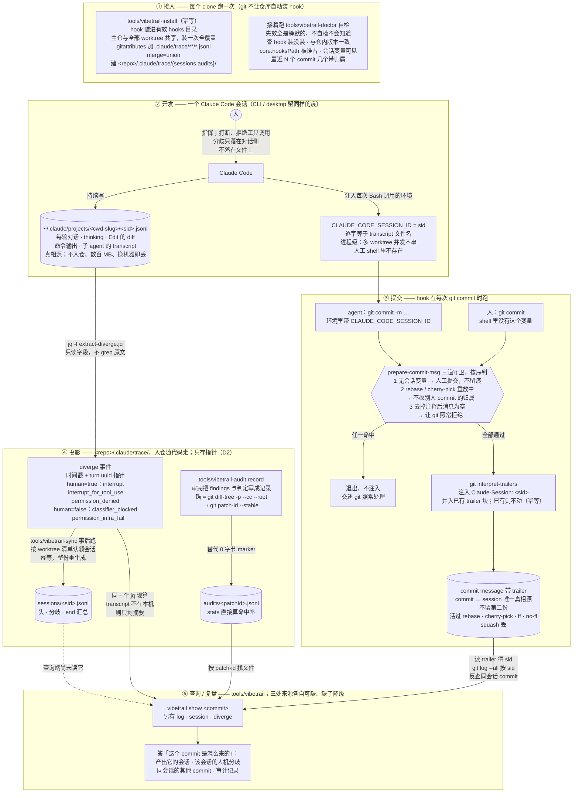

# vibetrail 功能与实现原理

> 与另两份文档的分工：[DESIGN.md](DESIGN.md) 记**为什么这么做**（问题定义、决策、否决理由），
> [spec/trace-v1.md](spec/trace-v1.md) 是**数据格式的规范**，本文记**有哪些功能、怎么实现的、
> 还缺什么**。

## 0. 一句话

把 Claude Code 已经在写的会话流水，提炼成能随代码走的工程留痕，用来回答两个问题：
**这个 commit 是怎么来的**，以及**出问题时人和 agent 在哪一步对不上**。

## 1. 功能清单

| 功能 | 状态 | 实现 |
|---|---|---|
| 人机分歧提取 | ✅ **已实现** | `tools/extract-diverge.jq` |
| 分歧判据回归测试 | ✅ **已实现** | `tools/fixtures.jsonl` + `tools/test-extract.sh` |
| hook 机制探针 | ✅ **已实现** | `experiments/hook-probe.sh` |
| commit ↔ session 接链 | ✅ **已实现** | `tools/prepare-commit-msg`（12 场景回归 + 5 组变异验证）|
| 接入 | ✅ **已实现** | `tools/vibetrail-install`（幂等）|
| 留痕自检 | ✅ **已实现** | `tools/vibetrail-doctor` |
| hook 回归测试 | ✅ **已实现** | `tools/test-hook.sh` |
| session 流水投影 | ✅ **已实现** | `tools/vibetrail-sync` |
| 审计过程留痕 | ✅ **已实现** | `tools/vibetrail-audit`（record / show / stats）|
| 查询 / 复盘 | ✅ **已实现** | `tools/vibetrail`（show / log / session / diverge）|
| 行级归属 | ❌ **已否决** | 见 [DESIGN.md §2.5](DESIGN.md) |

## 2. 实现原理

### 2.0 全流程

一张图看五段：**接入**每个 clone 一次；**开发**时 Claude Code 自己写流水，并把会话 id 注入
每次 Bash 调用的环境；**提交**时 hook 把这个 id 写进 commit message；**投影**把流水里跨会话
仍有价值的部分固化进仓；**查询**按 sid 与 patch-id 把三处数据接回去。
实线已实现；唯一一条虚线是还没接上的一段（查询端尚未读 sessions 文件）。
圆柱是数据落点，三处里只有 transcript 不入仓。



commit ↔ 会话之间只靠**一个 id** 接：Claude Code 注入进程环境的 `CLAUDE_CODE_SESSION_ID`，
被 hook 写进 trailer，又逐字等于 transcript 文件名。审计记录另按 patch-id 锚到 commit 的改动上
（[spec §4](spec/trace-v1.md)）。两把钥匙都在 commit 本身上——sid 读 trailer，patch-id 算 diff——
trace 里不存第二份关联，这就是 [spec §2](spec/trace-v1.md)「不留第二份」的由来。

### 2.1 采集：不自建，复用 Claude Code 的流水

**不写采集层**。Claude Code 本来就把每轮对话、思考全文、每次 Edit 的 diff、
每条命令的 stdout/stderr、子 agent 的独立 transcript 写进
`~/.claude/projects/<cwd-slug>/<sessionId>.jsonl`。

代价是它**不入仓、体量数百 MB、换机器即失**。所以我们做的是**投影**而非采集：
把其中跨会话仍有价值的部分固化成 KB 级的索引，正文留在原地靠 uuid 指针跳回。

### 2.2 人机分歧提取（已实现）

`tools/extract-diverge.jq` 从 transcript 提取四类事件，每条带 `human` 布尔区分
「人的决定」与「机器/基础设施行为」——混计会让「人拒了多少次」被分类器和链路故障污染。

| kind | human | 一句话 |
|---|---|---|
| `interrupt` | ✅ | 人打断了 agent |
| `permission_denied` | ✅ | 人拒绝了一次工具调用 |
| `classifier_blocked` | ❌ | auto mode 分类器拒的 |
| `permission_infra_fail` | ❌ | 权限链路自身失败 |

判据的精确定义**只在 [spec §3.1](spec/trace-v1.md) 维护一份**，这里不复述，避免两份漂移
（曾经漂过：这里的版本漏了字符串正文与 `with this tool use`）。

**核心原理是「只读字段，不 grep 原文」**。会话自身会讨论这些标记（本项目的调研会话就是），
grep 原文会把「讨论」当成「发生」。实测对照：以本项目调研会话为靶，裸 grep 命中 19 条、
本规则命中 2 条，人工核对真实中断正是 2 次——**精确率 100% vs 10.5%**。

全语料实测（**2026-09-09 重测**，756 个 transcript）：`interrupt` 248（人主动打断）、`interrupt_for_tool_use` 35（伴随拒绝）、
`permission_denied` 92（主会话 39 + 子 agent 53）、`permission_infra_fail` 6、
`classifier_blocked` 1。

⚠️ 09-08 测得 277 / 90，差异**全部来自语料增长**（我们工作时它一直在写）。
**引用需带测量日期。**判据细节与踩过的坑见
[spec §3.3](spec/trace-v1.md)。

### 2.3 commit ↔ session 接链（机制已实测）

`.githooks/prepare-commit-msg` 读**环境变量** `CLAUDE_CODE_SESSION_ID`
（实测逐字等于 transcript 文件名），注入 `Claude-Session:` trailer。

选环境变量而非状态文件，因为它是**进程级**的：多 worktree 并发各有各的值，
人工提交时变量根本不存在所以不会被误记成 agent 的。实测矩阵见 [spec §2.0](spec/trace-v1.md)：
最初五条（agent 提交带 / 人工不带 / amend 幂等 / worktree 生效 / 并发不串）加三轮审计补的六条
（agent rebase、cherry-pick 人工 commit 不沾 / 非编辑器路径 merge 可解析 / 已有 `Co-Authored-By`
等 trailer 保留 / 空消息仍被拒 / 编辑器路径不注入）全过。最初的 4 行版在补测的每一处都静默出错，
最重的一处：agent 一次 `git rebase main` 会把分支上所有人工 commit 记成 agent 的。

**trailer 活过历史重写**：rebase ✅ cherry-pick ✅ ff-only ✅ no-ff merge ✅；squash ❌——
`rebase -i` squash 只留最后一个被 squash 的 commit 的 trailer，`merge --squash` 原会话丢失、
记成执行者（agentDock 1760 个 commit 里 0 次 squash，不受影响）。

### 2.4b session 流水投影（`vibetrail-sync`）

**形态选择：事后投影，不是实时写。** session 文件是 transcript 的**纯投影**、随时可重算；
按 D2，trace 的作用是扛住 transcript 丢失与换机器，所以要求只是「在 transcript 消失之前
写下来」，不是「commit 那一刻必须同步」。这排除了在 pre-commit 里写+暂存那类方案
（每个 commit 都带 trace 改动，churn 大）。

三方对照：**SpecStory 也是事后 `sync`**（印证这个选择）；claude-story 用 `fs.watch`
常驻守护进程（要养一个进程，不取）。

**归属判据比 SpecStory 更宽**：它把 cwd 编码成 Claude 项目目录名做 1:1 反查，因此只看
当前 cwd 那一个目录，**在 worktree 里 sync 不到主仓的会话**。本仓大量用 worktree，
所以改成按 `git worktree list` 聚合全部 worktree 根。两侧路径都过 `realpath`——
这条是照它的 `EvalSymlinks` 补的，不做的话符号链接会让前缀匹配**静默失配**。

实测（agentDock）：26 个会话 / 419 条记录 / **220K**，对照 transcript 406MB，
约 1800 倍压缩，符合 D2 的 KB 级要求。

### 2.4c 审计过程留痕（`vibetrail-audit`）

**本项目唯一没有先例可抄的部分。** 业内工具审的都是**代码**——git-ai 记行级归属、
SpecStory 存对话、Memento 把 transcript 挂进 git notes，**没有一个记「审计本身」**。

它替代 0 字节 marker：旧做法只记「审过了」，不记「审了什么、报了几个、几真几假」，
于是命中率这类数字只能人肉从对话里数，而对话会被压缩掉。现在 `stats` 直接算：

```
{"审计次数":1, "finding 总数":4, "按判定":{"confirmed":3,"false-positive":1}, "命中率":"75%"}
```

**锚用 patch-id 不用 sha**——sha 在 rebase 后就变（实测本仓 294 个旧 marker 已有 4 个失效）。
计算式与 [spec §4](spec/trace-v1.md) 逐字一致，回归里有一条专门钉这个。

**SARIF 只取词汇不取封装**：SARIF 是 findings 的事实标准，但它为「带代码位置的工具输出」
设计，最小信封每个结果十几行样板，且没有「N 个 agent 各带视角」与「二次交叉验证」的概念。
我们保留紧凑 JSONL，finding 可带 SARIF 形状的 `location`，severity 记录到 SARIF `level`
的映射（HIGH→error / MED→warning / LOW→note），将来要导出是机械转换。

### 2.5 接入与自检

**`tools/vibetrail-install`** 装 hook、写 `.gitattributes`、建 `.claude/trace/`，幂等可反复跑。

关键决定是**装进有效 hooks 目录**（`git rev-parse --git-path hooks`）而**不是**
`.githooks/` + 改 `core.hooksPath`：

- `core.hooksPath` 可能已被别人占用——实测 agentDock 的 worktree 工具就在主仓 config
  和**每个** `config.worktree` 里写死绝对路径。我们再设会被覆盖，**且失败是静默的**：
  worktree 里 hook 不触发、trailer 为空、不报错。
- 有效目录在主仓与全部 worktree 之间共享，**装一次全覆盖**（实测）。

代价：`.git/hooks` 不入仓，所以**每个 clone 都要跑一次**。git 出于安全不允许仓库
自动装 hook，这一步无法省——业内（husky）的解法是**搭车在人本来就会跑的步骤上**
（它挂 `npm install`）。Go 项目没有等价物，agentDock 可搭 `Makefile`。见中心表 G3。

**`tools/vibetrail-doctor`** 回答「这个仓的留痕现在是不是真的在工作」：hook 装没装、
与仓内版本是否一致、`core.hooksPath` 被谁占用、最近 N 个 commit 有几个带归属。
存在的理由是**所有失效形态都是静默的**——漏装、被别的 hook 顶掉、上游改字段名，
都不报错，只是从此不再留痕。

### 2.4 回归保护

`tools/test-extract.sh` 跑 26 条正负例，比对的是**整条输出**（含 `human` 与全部字段名），
不只比 kind——否则 `human` 翻转、`t`/`at`/`branch` 字段名漂移都抓不到（实测变异全绿）。
判据依赖英文消息串、Claude Code 改文案即静默失效，**这个测试是唯一的哨兵**。

它检查两件事：判定结果是否符合预期，**以及 jq 是否报错**。后者是补上去的——
jq 在某条规则上抛错时，该记录**之后的规则**不再求值、之前的命中照常输出，然后继续下一条。
所以只比对输出抓不到「末尾规则抛错」这类 bug：曾经的「去掉 `toolUseResult` 类型守卫」
就是这样——输出一条不差、只有 stderr 刷屏，比对恒绿（实测假绿）。退出码也靠不住：
jq 的退出码只反映**最后一条**输入是否出错。

## 3. 还缺什么

**见 [OPEN-ISSUES.md §C 中心表](OPEN-ISSUES.md)**，那里是唯一的未完成项清单，
按类型（功能缺口 / 已知缺陷 / 待定决策 / 未量）与优先级排列，带关闭记录。

本节此前重复描述过其中若干项，已删——三份文档各记一份同样的开放状态，
是「必须与 X 保持一致」那类必然会漂的拷贝。**新增未完成项请只写进中心表。**
