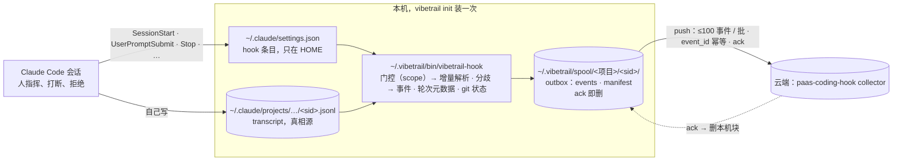

# vibetrail 设计：用 hook 把 Claude Code 会话的两路数据传上云

> **状态**（2026-09-15）：需求与设计定稿；第 1 步「提取器扩展与协议映射」已做（`tools/map-events.jq` + `tools/vibetrail-map`，细则 §4.2），
> hook 分发、安装、push 未开工。沿用的判据见 [spec/diverge-v1.md](spec/diverge-v1.md)。
> 上一版设计（留痕数据投影进被观测仓、git hook 写 `Claude-Session` trailer）已于 2026-09-14 退役，见 §7 D4；仍在用的审计记录线见 §8。
> 2026-09-15 D5：不传 transcript 原文件，正文只随人机分歧事件走，云端定为 paas-coding-hook 事件协议 1.0，索引保留 30 天够用。
>
> 文档分工：本文记**为什么与怎么做**；[CAPABILITIES.md](CAPABILITIES.md) 记**有什么、什么状态**；
> [OPEN-ISSUES.md](OPEN-ISSUES.md) 是**唯一的未完成项清单**；[TODO.md](TODO.md) 记拆解；[third-party/](third-party/) 是三方对照的原始材料。

## 0. 一句话

**机器级装一次**，之后每个 Claude Code 会话由 hook 自动采两路数据——**人机分歧**（打断、拒绝，带能判责的最小正文）和**轮次元数据**
（会话 / 轮次 / 子 agent 的起止、每轮起止的 HEAD 与 commit、状态、token 用量，不带正文）——映射成 paas-coding-hook 事件协议 1.0 的事件，
写进本机 outbox，经 HTTP push 到云端，ack 即删。**不传 transcript 原文件**，非分歧的消息与工具正文、thinking 都不传（§7 D5）。
被观测仓里**零写入**：不进 git、不写它的 settings、不装 git hook、不放运行时。

用户原话，按时间：

- 09-11：「目前先做hook采集两类数据，一类是是pilot全量的这种，但是要采全，可能有些还要补充，然后另一类是人机分歧这种关键数据」
- 09-14：「希望和teamai一样，用hook的方式，一个命令实现安装，然后会自动采集数据」
- 09-14：「我从来没说要放git，我会用hook把他用http的方式传云端」「暂时先不考虑脱敏」「什么时候说实时了，hook触发的时候采集一下，有就传」
- 09-14：「项目级和用户级都要，可配置的，参考teamai，不存git了，不要clone一次装一次，未来会push云端，暂时先缓存本地文件让我看输出内容，保留push动作。然后和teamai一样，装一次就行」
- 09-14：「我们应该也不把hook写进仓，之前的做法不需要」「现在我们的目标就是通过hook把数据传上去，尽量本地不要存太多东西」「如果不是常驻进程，用不到go吧」
- 09-14：「它没说transcript正文要进表吧？你在哪看到的」
- 09-15：「不用传全量的transcript文本，有必要吗」「正文的话，人机分歧先看看能不能带正文吧，其他的先不考虑，不然数据量有点大。如果后面有必要再补充」「数据30天没问题，超过一个月复盘意义不大」「读取不是我们读，我们只负责采，读取分析由其他服务完成」「turn.end 推荐 code，其实是自定义的，不是枚举的，interrupted我们可以直接加」「U1 默认 scope 取 project。意思是项目级别还是用户级别，这个是可配置项把，默认项目级别。参考teamai」

## 1. 要解决的问题

Claude Code 已经把每轮对话、thinking 全文、每次 Edit 的 diff、每条命令的输出、子 agent 的独立 transcript 写在
`~/.claude/projects/<cwd-slug>/<sid>.jsonl`。**问题不是没记**，是：

1. **它只在本机。** 不入仓、换机器即丢；CLI 会话默认 30 天清理，清理在启动时跑（本机 `~/.claude/.last-cleanup` 每次启动刷新），
   可能先于任何事后处理把源删掉。
2. **几百 MB 没有索引。** 本机 40 个主会话 700 MB，单个 106 MB。复盘要找「人在哪一步不同意机器」，得先有索引。
3. **commit 与会话没有关联。** `git blame` 只到行，到不了意图。

复盘要回答两问：**这个 commit 是怎么来的**；**出问题时人和 agent 在哪一步对不上**。答案都在 transcript 里，所以要做的是把答这两问要的那部分
（分歧及其上下文、每轮的 commit 关系）可靠地采出来、送到能查的地方，而不是自建一层采集；读取与分析由别的服务做（用户 09-15）。

## 2. 采什么：分歧带正文，其余只有元数据

| 路 | 采什么 | 正文 | 形态 |
|---|---|---|---|
| **人机分歧** | [spec/diverge-v1.md](spec/diverge-v1.md) 的 5 类 kind，映射成协议事件（§4.1） | **带**能判责的最小上下文：被拒调用的工具输入（命令 / 编辑内容）与拒绝原文；被打断的那条模型回复与打断后人的下一句 | 事件，每条 KB 级 |
| **轮次元数据** | session / turn / subagent 的起止事件；每轮起止的 HEAD、分支、脏否与 `rev-list` 出的 commit（§3.5）；轮次状态、model、token 用量；`InstructionsLoaded` / `CwdChanged` / `StopFailure` 等 hook 事件头（事件名、时间、`tool_use_id`、错误类型、reason、`agent_id`） | **不带**：非分歧轮次的消息、工具输入输出、thinking、system prompt、CLAUDE.md 正文都不传 | 事件，每轮几条、百字节级 |

**不传 transcript 原文件**（§7 D5）。两路按会话 id 关联——transcript 文件名与 hook 的 `session_id` 是同一个值——走同一条通道。分歧一路的提取仍是
diverge-v1 那份 jq，转成事件是它之后的一步。「后面有必要再补充」的口子留着：协议的 message.* / tool.* 与 ext.* 事件都在，要补正文时只是多映射几类记录，
采集端不用换形态。

### 2.1 「采全」的定义：人类侧一条不漏，靠条数对账

上一版把「采全」定义成 transcript 逐字节复制上云，为的是躲 Pilot 的坑；2026-09-15 用户否掉（数据量大，两问用不上），见 §7 D5。
现在「全」只对分歧成立：**人类侧每一条打断、拒绝都进事件**，钉子是每类 transcript 记录进多少条、出多少条事件（A2、A11），不是字节相等。
Pilot 的坑照样要防：它把 transcript 规范化成事件，模型与工具一侧全、人类一侧漏——打断 265 条只进 5 条，每轮第一条人类输入
1,599 条丢 154 条（[Pilot 采集清单 §1.2b](third-party/loongsuite-pilot-collection.md)）。根因是它按 promptId 分轮、只读 `user` / `assistant`
两种记录，而原始 transcript 里的记录类型远不止这两种。解析器要按记录逐条走、不按轮分组。本机清单（2026-09-14，40 个主会话 / 676 个子 agent 文件 / 700 MB，
Claude Code 2.1.142–2.1.266，入口全是 claude-desktop），标出人类侧记录在哪：

| 顶层 `type` | 条数 | 里面是什么 |
|---|---:|---|
| `assistant` | 54,260 | 模型回复：text / thinking / tool_use，`usage`、`requestId`、`model` |
| `user` | 28,258 | 人的输入、tool_result（`toolUseResult` 里有 Bash 的 `stdout` / `stderr` / `interrupted`，Edit 的 `structuredPatch` / `originalFile` / `oldString` / `newString`）、打断标记 |
| `attachment` | 13,632 | 40 种子类型，见下 |
| `last-prompt` / `ai-title` / `custom-title` | 7,864 / 7,169 / 4,361 | 会话元数据：最后一条 prompt 原文、标题 |
| `queue-operation` | 6,444 | 人排队的消息：enqueue 3,237 / dequeue 2,314 / remove 893，remove 里 296 条带 `reason: absorbed_mid_turn`（人在模型干活时插话，被并入当前轮） |
| `mode` | 5,748 | 模式切换 |
| `system` | 2,995 | `stop_hook_summary` 2,084（每次 Stop 跑了哪些 hook、报没报错）、`api_error` 860、`compact_boundary` 48、`local_command` 2、`model_refusal_fallback` 1 |
| `atis-latch` / `bridge-session` | 2,397 / 1,323 | 远程桥接；`bridge-session` 带 `ownerAccountUuid`、`ownerOrganizationUuid`——**身份类** |
| `worktree-state` | 1,039 | desktop 给会话开的 worktree：`originalCwd`、`worktreePath`、`worktreeBranch`、`originalHeadCommit` |
| `file-history-snapshot` / `file-history-delta` | 45 / 14 | 2.1.260 起的文件检查点：每轮一份快照、每次 Edit / Write 前一份备份指针，正文在 `~/.claude/file-history/<sid>/<hash>@vN`，是整份文件（本机 952 KB） |
| `frame-link` | 2 | — |

`attachment` 的 40 种子类型里与本项目有关的：`prompt_snapshot` 38（system prompt 与全部工具定义，§6.3）；`hook_blocking_error` 332 /
`hook_success` 9 / `hook_cancelled` 1（hook 的结果，含命令与 stdout）；`edited_text_file` 327（Read 过的文件在磁盘上被改了——抽样都是 agent
自己的命令改的，不是人）；`queued_command` 713（排队的人话原文，`origin.kind: human`）；`command_permissions` / `auto_mode` / `auto_mode_exit`
34 / 34 / 1（权限模式）；`instructions` 17 / `nested_memory` 7（加载的 CLAUDE.md）；`skill_listing` 102 / `mcp_instructions_delta` 105 /
`environment` 82 / `session_context` 24（拼 system prompt 用）。其余是提醒类：`total_tokens_reminder` 8,333、`task_reminder` 2,397……

分歧相关的人类侧记录只在 `user`（打断标记、`is_error` 的拒绝正文）与 `queue-operation`（插话）里；其余类型是元数据或旁证，D5 后不传。
规范化成事件的风险（Pilot 重走一遍）靠两条挡：判据只认字段不 grep 原文（diverge-v1 §4），条数进出对账（A2）。

### 2.2 对照 Pilot：哪些进事件、哪些不进

| Pilot 漏的 / 我们要的 | transcript 里在哪 | D5 后怎么处理 |
|---|---|---|
| 打断记录（265 → 5） | `user` 记录的 text 块 | 进 `turn.end`（code `interrupted`）；子 agent 文件里的进 `subagent.end`（`cancelled`）；带被打断的回复与打断后的人话 |
| 每轮第一条人类输入（1,599 → 1,445） | `user` 记录 | 轮次本身进 `turn.start` / `turn.end`（元数据）；正文只在被打断的轮次带 |
| 被拒与执行失败分不开 | 拒绝正文在 `is_error` 块里，判据在 diverge-v1 | 人拒 / 分类器拦 / 链路故障进 `permission.decision`（decided_by 区分），执行失败才是 `tool.end(failed)`；hook 侧另有类型化的 `PostToolUseFailure`（不含权限拒绝）与 `PermissionDenied`（只在 auto mode），见 §3.2 |
| 被拒调用的输入（命令 / 编辑内容） | 前一条 assistant 记录的 `tool_use` 块，按 `tool_use_id` 反查 | 进被拒调用的 `tool.request.input`，同时得到 `tool_name`（G5 前置） |
| Edit 的 `structuredPatch` / `originalFile`，Bash 的 `stdout` / `stderr` | `toolUseResult` | **不传**（非分歧正文） |
| `uuid` / `promptId` / `requestId` | 有 | `event_id` 从记录 uuid 派生（§4.2），`turn_id` = promptId。打断记录也带 promptId（09-15 抽样 277 条全带，原以为「常没有」是错的）；缺失时按位置推、provenance 标 inferred，fixture 钉着 |
| system prompt、CLAUDE.md 正文 | ≥ 2.1.258 有 `prompt_snapshot`；`InstructionsLoaded` hook 给路径 | **不传**；`InstructionsLoaded` 只记路径与 sha 的事件头。「有必要再补充」 |
| **git 状态**（HEAD、工作树） | **没有** | hook 侧富化：UserPromptSubmit / Stop 各记一次 HEAD、分支、脏否，进 `turn.start` / `turn.end` 的 vcs；worktree 根与脏文件数放 extensions。逐次工具调用的工作树是 G11 的事 |

## 3. 怎么采：只用 hook

**边界**：只有 Claude Code 的 harness hook。不常驻守护进程、不改 shell rc、不注入进程、不改写用户命令、不装 git hook、不往被观测仓写任何东西。
Pilot 的拦截器路线（[对比 §6.3](third-party/teamai-cli-vs-vibetrail.md)）已否；system prompt 新版 transcript 自带快照（§6.3），不需要拦截。

### 3.1 事件与动作

| 事件 | 动作 | 同步 / 异步 |
|---|---|---|
| `SessionStart` | 门控（按 scope，§5）→ 发 `session.start`（`source`、capabilities）、记 git 状态 → **补做**：本仓（按 `git worktree list` 归属）所有 offset 落后于文件大小的 transcript，各补一次解析（分歧 + 轮次元数据）与 push。agent 崩溃、被杀、`-p` 模式下 Stop / SessionEnd 都不来，全靠这一步 | 门控与记录同步；补做丢后台 |
| `UserPromptSubmit` | 发 `turn.start`（`prompt_id` 作 turn_id、model、git 状态）；顺手解析一次新增记录（不 push）——打断只能在这里或下面两处补读 | 30 s 上限；stdout 会进模型上下文，**必须为空** |
| `Stop` | 解析新增记录 + 发 `turn.end`（status、usage、git 状态、`rev-list` 出的 commits）+ **push 一批**（本轮新增的，连同之前没传成的；端点未配置时这一步只记账不发） | `async: true`：不阻塞、不计 timeout |
| `SubagentStart` / `SubagentStop` | 发 `subagent.start` / `subagent.end`（`agent_id` 作实例 id、`agent_type`、父实例 `main`、派生它的 `parent_call_id`）；Stop 时再扫一遍 `subagents/` 目录——后台子 agent 在父 Stop 之后才结束 | 异步 |
| `PostToolUseFailure` / `PermissionDenied` / `StopFailure` / `Notification`（`permission_prompt`） | 只记事件头，发 `ext.claude.<事件名>`：`tool_use_id`、`error` / `reason` / `notification_type`、时间。类型化信号，见 §3.2 | 同步，毫秒级 |
| `InstructionsLoaded` | 记 `file_path`、`load_reason`、正文 sha；正文不传（D5，有必要再补） | 官方说明它本身异步跑 |
| `CwdChanged` | 记 `old_cwd` / `new_cwd`（G11 接手检测的同一挂载点） | 同步 |
| `SessionEnd` | 发 `session.end`（`reason`、status）；预算 1.5 s（`CLAUDE_CODE_SESSIONEND_HOOKS_TIMEOUT_MS` 可抬），来不及的交给下一次 SessionStart 补做 | 同步 |

不挂 `PreToolUse` / `PostToolUse`：每次工具调用多跑一个进程，而它们给的 `tool_input` / `tool_response` transcript 里全有，且 D5 后除被拒调用的输入外都不传。
hook payload 里的 `tool_input` / `tool_response` 也不另存一份——transcript 全有。Pilot 的输出里每份内容出现 3 次（`tool.call`、`llm.response`、
下一次 `llm.request` 的输入增量各一份），就是同一内容多处存的下场。

**什么时候读**：每次 hook 触发读一次 transcript，有新的就提取、就传（用户原话「hook触发的时候采集一下，有就传」），没有实时的要求。
`transcript_path` 是异步写的、可能落后于内存里的对话，Stop 时读到的可能缺本轮最后几条，下一次 hook 补上。都不是缺口，是机制。

### 3.2 分歧一路为什么还是要读 transcript

两类人的分歧都**没有 hook 事件**（官方文档，2026-09-14 核）：Stop 在用户打断时不触发（「They don't fire on user interrupts」）；权限被人拒
只有 PreToolUse、没有任何结束事件——`PostToolUseFailure` 明写不含权限拒绝，`PermissionDenied` 只在 auto mode 发。所以 `interrupt` /
`permission_denied` 仍靠 diverge-v1 读 transcript 的字符串判据，脆弱性不变（G6）。

机器一侧倒有了类型化来源：`PermissionDenied`（≈ `classifier_blocked`）、`PostToolUseFailure`（工具失败，不是分歧）、`StopFailure`（API 错，
带 `error` 类型）。hook 事件流记下它们的 `tool_use_id`，就能和 transcript 里的字符串判定对账——两边对不上就是判据漂了，这正是 G6 要的哨兵。

### 3.3 增量解析与本机 outbox

- 每个 transcript 文件记消费到的 byte offset 与行号，存 `~/.vibetrail/state/<sid>.json`；每次只解析到源文件**最后一个换行符**为止（源可能正在写半行）。不复制文件。
  映射层按行号门控、整文件重读（§4.2）：索引每次重建，只对新触发记录发事件。
- 源文件长度 < offset 时从 0 重读（重写守卫）。transcript 目前是 append-only，但 `file-history-snapshot` 带 `isSnapshotUpdate` 字段，不能假设永远是。
- 首次全读、无单次上限。Pilot 首次只读最后一轮、单次超过 50 MB 只读尾部，那份 111 MB 的会话前段整个丢掉，4 条拒绝没了。
- 子 agent 文件按 `<sid>/subagents/` 目录扫，不只信 hook 递来的那一个路径——teamai 栽在这里，58% 的人拒在子 agent 文件里
  （[对比 §3.2](third-party/teamai-cli-vs-vibetrail.md)）。
- 产物写临时文件 + 原子 rename；每个会话一个目录，多 worktree 并发不共享文件，不加锁。失败日志只留元数据，不留 payload
  （teamai 上报失败把整份 context 连 prompt 摘要写盘，别学）。
- **本机不是存档，spool 是过手的 outbox**：push 在产出数据的同一个 hook 里发（Stop 异步；SessionStart 补做也发），服务端 ack 即删；本机常驻只有
  `state/`（offset、push 水位，KB 级）与还没 ack 的块。端点未配置的现阶段它才是「全部」，文件可读、不压缩，就是用户要先看的「输出内容」。
- 布局：`~/.vibetrail/spool/<项目键>/<sid>/` 下 `events.jsonl`（协议形状的事件，分歧与轮次元数据都在，每行一条、按 `event_id` 幂等）与
  `manifest.json`（每个 transcript 文件的 offset、Claude Code 版本、push 水位）。不再有副本目录；分歧提取器的原始输出是中间产物，A3 拿它对账。
  批次按协议打（≤ 100 条 / 16 MiB），不另立 spool spec，事件形状以协议 schema 为准（[原件进仓](third-party/collection-batch-1.0.schema.json)作回归输入）。

### 3.4 hook 纪律

`exit 0`；stdout 为空（SessionStart / UserPromptSubmit 的 stdout 会进模型上下文）；每条显式 `timeout`；命令用绝对路径、不依赖 PATH——
desktop 启动的 hook 拿到什么 PATH 未测，jq 的绝对路径由 init 写进配置（§5.3）；`-p` 模式下 async hook 在会话结束时被杀，靠下一次 SessionStart
补做兜底；所有 hook 并行跑，与被观测仓自己的 Stop hook（agentDock 有三个）互不等待。每条记录带 Claude Code 版本与 `hook_event_name`——
判据靠英文串、`prompt_snapshot` 只在 ≥ 2.1.258、hook 事件集随版本变（文档列 30 余种，2.1.260 bundle 里 33 种），同一台机器 CLI（2.1.12）
与 desktop 自带（2.1.266）并存；doctor 报版本与未知事件。

### 3.5 commit ↔ session：从每轮起止的 HEAD 推，不再靠 trailer

UserPromptSubmit 记轮起 HEAD，Stop 记轮止 HEAD，并记 `git rev-list <起>..<止>`（一轮多 commit 也全在）；起不是止的祖先时（rebase / reset）
改记这段时间内 reflog 新增的 sha；Bash 的 `git commit` stdout 里的短 sha 作旁证。人在别的终端提交会被算进当轮，靠 committer 与 transcript 里
有没有对应的 Bash 调用区分，标 `inferred`。失去的只有一样：`git log` 里不用工具就能看到会话 id。这条推导替代了上一版的
`Claude-Session` trailer（§7 D4）；它记的仍是「哪个会话执行了提交」，「每一行出自哪个会话」是 G11 的事。落到协议里是 `turn.start` / `turn.end` 的
`vcs` 快照与 `turn.end.commits[]`（完整 sha、`relation=observed`、evidence `before_after`；Bash stdout 里的旁证走 `tool_result`）。

### 3.6 流程

被观测仓不在图里：它里面什么都不写。

## 4. 去哪：本机 outbox → HTTP push 到 paas-coding-hook collector

| | 事件（分歧 + 轮次元数据，同一条通道） |
|---|---|
| 去向 | **云端已定**（§7 D5）：paas-coding-hook 事件协议 1.0 的 collector，`POST /api/v1/collection/batches`（[协议意见](third-party/paas-coding-hook-protocol-feedback.md)）。现阶段端点还没有：spool 里的事件就是将来 push 的内容，先让人看；push 动作第一版就在，端点未配置时不发只记账。**不进 git**；读取与分析不归本项目 |
| push 怎么传 | 端点与 token 在 `~/.vibetrail/config` 里配，没配就不发（spool 完整保留，`vibetrail push --list` 看待发清单）。配了：按协议打批，≤ 100 条 / 16 MiB，单条 ≤ 1 MiB，超限不截断、整条拒收，要计数告警；`event_id` = UUIDv5(会话 id, 记录 uuid, 事件种类)，重发幂等；服务端返回 accepted + duplicate 后推进 push 水位并删本机块；失败留 spool，下次 hook 顺手重发；失败日志只留元数据。索引在 MySQL 事务提交后才返回，正文 Span 尽力投递，接受偶发丢正文（分歧的事实在索引里）。请求暂不支持压缩（已提意见）。仍未定：端点地址、token 怎么发与续期（U4） |
| 保留 | 端点未配置前 spool 积着（上限与超限策略 U5，倾向只警告不丢）。配置后 **ack 即删**，不留 N 天。云端索引保留 30 天，**够用**（用户 09-15：「超过一个月复盘意义不大」）。仍要在会话自己的 Stop / SessionEnd 里落 spool，SessionStart 补做只是兜底——transcript 清理可能先于 hook 把源删掉 |
| 体积 | 每会话 KB 级：分歧事件带被拒命令与被打断的回复，单条通常远小于 1 MiB；元数据每轮几条、百字节级。上一版 700 MB 字节流的分块与压缩问题随 D5 消失 |
| 隐私 | 出本机的正文只剩：被拒调用的工具输入与拒绝原文、被打断的模型回复、打断后人的下一句。可能含命令里的密钥与代码片段。**暂不脱敏**（用户 09-14，K6），先原样传。云端「记录默认对公司已登录用户可见」（协议与 collector 文档），是目前唯一的闸而且是开的，已提意见 |

### 4.1 映射到协议 1.0

| 我们的 | 协议事件 | 关键字段 |
|---|---|---|
| `interrupt` | `turn.end`，status code `interrupted` / category `cancellation`，detail 是标记原文 | `turn_id` = promptId（打断记录带；缺失才按位置推、provenance 标 inferred）。正文：沿 `parentUuid` 回溯到最近的 assistant 记录——有 text 块发 `message.assistant`，有 `tool_use` 块发 `tool.request`（在跑的调用）；打断后人的下一句发 `message.user`（delivery `direct`）。payload 另带 model、本轮 usage、vcs.branch |
| `permission_denied`（+ 伴随的 `interrupt_for_tool_use`，n:1，计一次） | `permission.decision`，decision `deny`，decided_by `user`，`permission_id` = `call_id` | `tool_name` 必填：`The user doesn't want to proceed` 形态里没有工具名，用 `is_error` 块的 `tool_use_id` 反查 `tool_use` 块的 `name`（G5 已关）→ 反查不到退 `Permission to use (\S+)` 捕获 → 再退 `unknown`，来路记 `extensions.vibetrail.tool_lookup`。正文：反查到的 `input` 发一条 `tool.request`；拒绝原文放 `reason`（≤ 4096）；拒绝后人的下一句也发 `message.user`（与打断同款——判责要的就是这一句，比 §2 多带一句）。for-tool-use 记录被吸收不另发；同一轮没有拒绝可配的按打断发、detail 标 unpaired |
| `classifier_blocked` | 同上，decided_by `policy` | 同上 |
| `permission_infra_fail` | 同上，decision `error`，decided_by `system` | 同上 |
| 子 agent 文件里的打断 | `subagent.end`，status `cancelled` | 父会话那条是 `turn.end`，两个事实，不去重（K1 关闭）；统计打断只数 `turn.end` |
| 轮次 | `turn.start`（model、vcs）/ `turn.end`（status、usage、vcs、commits[]） | UserPromptSubmit / Stop 各一条；Stop 不来（打断、崩溃）时 `turn.end` 由 transcript 或 SessionStart 补做给出，status `interrupted` / `unknown` |
| 会话、子 agent | `session.start`（source、capabilities）/ `session.end`（reason、status）/ `subagent.start`（agent_type、父实例、`parent_call_id`）/ `subagent.end` | hook payload 直接给 |
| hook 事件头 | `ext.claude.<事件名>`，provenance `hook` + `source_event` | `InstructionsLoaded` 只带路径与 sha |

Schema 硬规则（[collection-batch-1.0.schema.json](third-party/collection-batch-1.0.schema.json)）：枚举类字段全是小写 `code` 型；`permission.decision` 必填
`permission_id` / `tool_name` / `decision` / `decided_by`；`provenance.kind=transcript` 必带 `rule_version`；`files[].evidence=tool_argument` 只能是
`target` / `read`，说「改了」要 `tool_result` 或 `before_after`；路径必须在工作区根内、不能 `..`（跨仓改动 K2 没有表达法）；`commits` 只能挂 `turn.end`、
非空、完整 sha；`ext.*` 必带 `provenance.source_event`；thinking 不能当 assistant 文本。`client.name` 是 const `paas-coding-hook`，先照填（已提意见），vibetrail 自己的版本放 `extensions.vibetrail.version`；`policy_version` 填 `none-0` 表示暂不脱敏（两个默认值用户 09-15 认可）。
`workspace_id` 取主 checkout（`git worktree list` 第一条），与 G8 的分区键一致，worktree 路径放 extensions。

### 4.2 映射细则

实现 `tools/map-events.jq`（include 判据模块 `diverge-rules.jq`），驱动 `tools/vibetrail-map`（填 `event_id`、出账本），
回归 `tools/test-map.sh`（8 份 fixtures + scenario 回放；断言 + golden + schema + A2 对账 + 每个切点的增量等价）。

- **触发与派生。** 每条分歧命中是一个触发记录；它派生出的事件（被拒调用的 `tool.request`、被打断的回复、之后人的下一句）
  都挂在触发记录上：`extensions.vibetrail.trigger` / `vibetrail.after` 指回触发记录的 uuid，`vibetrail.kind` 记原始 kind，
  `raw` 保留提取器的原始命中（A3 对账用），`provenance.source_event_id` 是事件自己来源记录的 uuid。
- **增量按行号门控、整文件重读。** 每次从文件头读到最后一个换行符，只对**触发记录**行号 > 上次消费行号的分歧发事件；
  索引（tool_use、`parentUuid` 链、当前轮）每次重建。派生事件按 `_key` 去重，**登记不看门控**——「先扫到一半、再扫全文」发出的
  集合与一次扫全文相同（test-map.sh 对每个切点钉着；两种变异各被抓到一次）。账本记 `consumed_bytes` 与 `lines`。
  代价：106 MB / 4.9 万行的 transcript 纯映射 10.5 s，5.8 MB 0.7 s（09-15，C02FM）——挂 UserPromptSubmit 前要定（U11）。
- **`event_id`** = UUIDv5(固定命名空间 uuid5(NS_URL, "vibetrail"), "`<sid>|<记录 uuid>|<事件类型>|<限定符>`")，限定符是 `call_id` / kind；
  同一输入重跑同一个 id，重发幂等靠它。SHA-1 用 `shasum` / `sha1sum`，不引入 python。
- **`turn_id`** = 记录的 promptId；没有就取最近见到的 promptId，再没有就用记录 uuid，后两种 provenance.kind 标 `inferred`（带 `rule_version`）。
  派生事件跟触发记录的轮次走。
- **实例。** 主会话 `agent_instance_id` = `main`；子 agent 文件里 = `agentId`（每条记录都带），`parent_agent_instance_id` = `main`，
  `parent_call_id` = 同名 `meta.json` 的 `toolUseId`，`agent_type` 取 `agentType`；`session_id` 都是父会话 id（文件名 / 上两级目录名）。
  子 agent 文件里的 user 记录是父 agent 派活或注入，不算「人的下一句」。
- **正文取法。** 回复正文 = text 块拼接（不含 thinking）；人话 = 字符串正文或 text 块，去掉 `<system-reminder>` 块；
  以 `<system-reminder>` / `<local-command-*>` / `<command-name>` / `<task-notification>` / `<bash-*>` 开头的、`isMeta`、`isCompactSummary` 都不算人话
  （09-15 抽样：`system-reminder` 是 `isMeta:false` 的字符串，`local-command-caveat` 才是 `isMeta:true`，所以不能只看 isMeta）。
- **`turn.end(interrupted)` 的 usage** = 本轮 assistant 记录按 `message.id` 去重后求和（同一 id 的 4 条记录 usage 相同）：
  input = `input_tokens` + `cache_creation_input_tokens`，cached = `cache_read_input_tokens`，reasoning = `thinking_tokens`，total = 三者之和。
  vcs 只有 branch——transcript 里没有 HEAD，hook 侧补。Stop 路径的 `turn.end` 用同一定义。
- **状态有上界**：tool_use 索引 500 条、记录链 400 条；分歧引用的永远是最近几条记录。多态字段一律先判 type（判据的铁律照用）。
- **默认值**：`project_id` / `workspace_id` 没传就取 transcript 第一条记录的 `cwd`，hook 分发入口会传真值；`vibetrail.version` 先填 `0.2.0-dev`。

## 5. 安装与范围

照 teamai：**机器级装一次**（`vibetrail init`），之后不再有「每个 clone 跑一次」这一步。hook 条目**只写 HOME 的 `~/.claude/settings.json`，
不写进任何仓**。「项目级 / 用户级」是 scope 配置，决定采哪些目录，不决定 hook 条目放哪：

| 层 | 做什么 | 幂等 / 升级 |
|---|---|---|
| 机器级（一次） | 运行时放 `~/.vibetrail/bin/`（hook 命令必须是绝对路径，触发时还不知道在哪个仓）；往 `~/.claude/settings.json` 写 hook 条目；建 `~/.vibetrail/{spool,state,projects,config}`；将来的云端鉴权 token 放 `~/.vibetrail/`（0600，teamai 的 `~/.teamai/token` 同款） | 条目带 marker，升级按 marker 换掉自家旧条目（Pilot 的做法）；不建守护进程、不改 shell rc、不注入进程 |
| scope（可配） | `project`（**默认**，用户 09-15 定，参考 teamai）：只采登记过的项目，分发入口查 `~/.vibetrail/projects/`，未登记直接退出（G8）。`user`：本机所有目录都采，不看登记表——用户显式选才开。配置在 `~/.vibetrail/config` | 改配置即生效，hook 每次触发读一次 |
| 登记（scope=project 的开关） | `vibetrail init` 在仓里跑时顺手登记本仓（键 = `git worktree list` 第一条的主 checkout，worktree 共享）；另有 `vibetrail projects add / remove / list`（U2）。登记表在 HOME，仓里不留痕 | 幂等 |
| 自检 | `vibetrail-doctor`：条目在不在、指向的运行时与 jq 在不在、版本一致否；scope 与本仓登记了没；最近 N 个会话的 `stop_hook_summary` 里有几个跑过我们的命令（transcript 自带这条证据，不用另存状态）；spool 积压、offset 落后、端点配没配；本机语料里有没有已知清单之外的 `type` / `attachment.type` / hook 事件名（G6） | — |
| 卸载 | `vibetrail uninstall`：settings 条目、`~/.vibetrail/bin` 与 state 还原；`--purge` 才删 spool。被观测仓里没有东西要还原 | — |

### 5.1 怎么参考 teamai

（[实跑样例 §2.6](third-party/teamai-cli-collection-sample.md)、[分析 §4.3](third-party/teamai-cli.md)）

- teamai 的 `--scope user` / `--scope project` 决定的是**配置与资源**放 HOME 还是项目分区、哪个团队仓收上报；hook 条目**两种 scope 都写 HOME 级**
  `~/.claude/settings.json`（`types.ts:1497-1503`）。我们照这个：条目只在 HOME，scope 只管采集范围。teamai 把条目提交进仓的 self 模式不学。
- 它不碰 git hook，我们现在也不碰。
- 它的分发层 fail-open、没 init 的目录一样采；我们 scope=project 时门控在分发入口，未登记直接退出（G8）。
- 它没有下载二进制：npm 全局包，靠机器上已装的 Node 跑，hook 命令 `bash -lc "teamai hook-dispatch … 2>/dev/null" || true` 用登录 shell 的 PATH
  找 `teamai`；只给 WorkBuddy / CodeBuddy 那类没 PATH 的 GUI 写一个带 node 绝对路径的包装脚本。下载托管 node 的是 Pilot。

### 5.2 官方文档核过的事实（hooks 文档，2026-09-14 取）

- 交互会话里所有 settings 文件的 hook——含 `~/.claude/settings.json`——都要等用户对该目录接受过 workspace trust 才跑；`-p` / SDK 会话不弹。
  这是目录级的信任确认，不是 hook 专属的。实证：agentDock 的项目级 Stop hook 在 desktop 下真跑了（本机 transcript 里 `stop_hook_summary`
  含 `check-audit-stop.sh` 1,941 次）。
- settings 改动热加载（file watcher），desktop 与 CLI 都是。
- Stop 支持 `async: true`；SessionEnd 预算 1.5 s；`-p` 模式下 async hook 在会话结束时被杀。

### 5.3 实现栈：bash + jq + curl，不做 Go

没有常驻进程，每次 hook 是一个短命进程，bash 够用；已有的判据、fixtures、回放都是 bash + jq。唯一的运行时依赖是 jq（macOS 不自带），
init 时把它的绝对路径写进 `~/.vibetrail/config`，hook 不靠 PATH；doctor 校验。curl 系统自带。Go 单二进制的好处（零依赖、HTTP 顺手）
在这个形态下不值一个新栈；将来 push 那层若在 bash 里写不干净再议。

## 6. 实测地基（仍成立的旧结论）

### 6.1 hook 在 desktop 下可用且热加载

向 `.claude/settings.local.json` 注入 `PostToolUse` 探针后立即生效，捕获到的 stdin 含 `session_id, transcript_path, cwd, permission_mode,
prompt_id, hook_event_name, tool_name, tool_input, tool_response, tool_use_id, duration_ms`。**`transcript_path` 直接给出本会话 JSONL 的绝对路径**，
不需要 ID 映射（desktop 侧 MCP 报的 `local_<uuid>` 与 transcript 文件名不是同一个 ID 空间，hook 绕开了这个问题）。
`CLAUDE_CODE_SESSION_ID` 注入在每个 Bash 调用的环境里，逐字等于 transcript 文件名；子 agent 的 Bash 里拿到的是父会话的 id。

推论：文件监听型与 hook 型工具 CLI / desktop 通用，进程包装型（`specstory run claude`）只能 CLI。所以开发者用哪个都留同样的痕，不必二选一。

### 6.2 分歧在对话侧，不在文件侧

`userModified` 全语料 3507 次全为 `false`，desktop 的审批面板只有 Deny / Allow once，没有「修改提案」；`staleRecovered` 会触发（21 次）
但无一例是人改的。人指挥、Claude 动手，人不碰文件。全文见 [spec/diverge-v1.md §5](spec/diverge-v1.md)。分歧判据（打断、拒绝）755 会话实测
精确率 100%，裸 grep 只有 10.5%。

### 6.3 system prompt：新版 transcript 自带快照（2026-09-11 补测）

hook 的输入里没有 system prompt（2.1.260 的 33 种 hook 事件、34 处构造 hook 输入，没有一处带）。transcript 里**从 2.1.258 起有**：`attachment`
条目 `prompt_snapshot`，含 `cliPrefix`、`systemPrompt`（12 段，约 8.3k 字）、`tools`（全部工具定义，约 5.2 万字）。会话开始时写一份，prompt 变了
再写。本机 39 个会话：2.1.142–2.1.247 的 25 个都没有，2.1.258 / 2.1.260 的 14 个都有。**所以只靠 hook 就能采，不要拦截器**。
不等于发给模型的那一份（desktop 追加的安全规则不在快照里；MCP 说明、skill 列表、环境信息、CLAUDE.md 是另外几种条目，要自己拼）；子 agent 没有；
老会话补不回来。CLAUDE.md 另有 `InstructionsLoaded` hook，当场存内容即可——判责最用得上的是这部分。

### 6.4 三方对照，只留结论

- **teamai**：装一次、hook 分发、机器数据在 HOME——安装形态照它。采集只有计数与 prompt 摘要；判据层漏 52% 的人拒（不认 `Permission to use` 形态），
  运行时再漏一次（不扫子 agent 文件，58% 的人拒在那里），合计只登记 40%；fail-open 到处采；上报失败把整份 context 写盘——都别学。[teamai-cli.md](third-party/teamai-cli.md)、[对比](third-party/teamai-cli-vs-vibetrail.md)。
- **LoongSuite Pilot**：hook + 拦截器 + 常驻，事件模型漏人类侧（打断 265 → 5）、每份内容出现 3 次、首次只读最后一轮。可借的是 spool 原子写、
  升级清自家旧条目、装卸对称、`--purge` 才删数据、不依赖用户运行时。[loongsuite-pilot.md](third-party/loongsuite-pilot.md)、
  [采集清单](third-party/loongsuite-pilot-collection.md)、[实跑样例](third-party/loongsuite-pilot-collection-sample.md)。
- **paas-coding-hook 事件协议 1.0**：云端已定（D5）。第二版采纳了第一轮全部意见（拒绝进 `permission.decision`、子 agent 挂父会话、`provenance` + `rule_version`、
  `agent.version`、`ext.*`）；第二轮意见（gzip、失败 event_id、SDK 上限、可见性、跨仓路径、`client.name`）见 [意见](third-party/paas-coding-hook-protocol-feedback.md)。映射见 §4.1。
- **同一段示例会话过一遍 Pilot 与 teamai 各记下了什么**：[teamai 实跑](third-party/teamai-cli-collection-sample.md)、
  [Pilot 实跑](third-party/loongsuite-pilot-collection-sample.md)、[Pilot 原始输出](third-party/loongsuite-pilot-collection-output.md)。

## 7. 决策记录

### D5 — 不传 transcript 原文件；正文只随人机分歧事件走；云端定为 paas-coding-hook 协议 1.0；保留 30 天够用（2026-09-15，现行）

用户原话见 §0。定了什么：

- **全量一路改为轮次元数据。** 09-14 写进 §2 的「原始 transcript 逐字节副本上云」撤销：用户当天已质疑「它没说 transcript 正文要进表吧」，09-15 明确
  「不用传全量的 transcript 文本」。理由是数据量，两问也用不上。
- **正文只在分歧事件上带**：被拒调用的输入与拒绝原文、被打断的回复与打断后的人话。其余（非分歧消息、工具输入输出、thinking、system prompt、CLAUDE.md）
  不传，「如果后面有必要再补充」——协议的 message.* / tool.* 事件留着这个口子。
- **云端就是 paas-coding-hook 的 collector**，采集端映射成协议事件（§4.1）。`turn.end` 的 status.code 是自定义值，`interrupted` 直接用，不等服务端。
  U3 关闭，U4 只剩端点与 token。
- **索引保留 30 天够用**：「超过一个月复盘意义不大」。U10 关闭。
- **读取与分析不归本项目**：「读取不是我们读，我们只负责采」。查询端只留 push 前的本地预览（G9 再缩）。

代价写明：G11 §6 第 3 步「回原始 transcript 还原现场」只在本机 30 天内有来源；分歧之外的对话正文不在云端。

### D4 — 两路数据不进 git：本机 outbox，hook 经 HTTP push 云端；hook 与 git hook 都不写进仓（2026-09-14，现行；采什么与去哪 09-15 由 D5 修正）

用户原话见 §0。定了什么：

- **两路数据都不进 git。** 仓内 `.claude/trace/sessions/` 的投影停用，`vibetrail-sync` 退役。D1「随代码走、team 可见、换机器不丢」三条诉求
  改由云端承担；D1 / D2 从此只管审计记录（§8），它是否也搬出仓暂不定（U6）。
- **去向是云端，hook 经 HTTP push。** 这推翻了 D1 否掉的「上报外部服务」。当初的理由（发到外部等于发布；stdout 可能含 API key、内部路径）不作废，
  转成 push 的前置条件：只采登记过的项目（G8）、失败日志不留 payload。脱敏（K6）暂缓，先原样传。
- **本机不是存档。** push 在产出数据的同一个 hook 里发，ack 即删，本机常驻只有 offset 与没 ack 的块。现阶段没有云端：spool 里的文件就是将来
  push 的内容，先让人看；push 动作第一版就在，端点没配置时不发只记账。G9 的本地查看在端点配置后改看清单与元数据。
- **安装照 teamai：机器级装一次**，不再每个 clone 装。hook 条目只写 HOME 的 `~/.claude/settings.json`；「项目级 / 用户级」是 scope 配置，默认 `project`（U1，09-15 定）。
- **被观测仓里零写入。** `prepare-commit-msg` 的 `Claude-Session` trailer 退役——不再往任何仓的 `.git/hooks` 写东西，仓内 vendor、`.gitattributes`
  也不再需要。commit ↔ session 改从每轮起止的 HEAD 推（§3.5）；trailer 机制的实测结论留在 git 历史与 `tools/test-hook.sh`。
- **实现栈 bash + jq + curl**，不做 Go（§5.3）。

代价写明：端点配置之前，「team 可见、换机器不丢」都没有，只有本机；`git log` 里不再直接看到会话 id；端点未配置阶段 spool 会积到本机全量的量级。

### D1 / D2 — 留痕数据落在仓内 `.claude/trace/` 并入 git，只存指针与摘要（2026-09-08 定，2026-09-14 被 D4 取代）

当时的理由：随代码走、team 可见、换机器不丢，只有入 git 满足；正文不进仓（单会话 106 MB、项目 406 MB 撑爆仓库；stdout 可能含密钥）。
否掉的选项：本地 SQLite（不随仓走）、sidecar 仓（要自己同步、关联靠时间戳）、上报外部服务（等于发布）。
被取代的原因：用户要的是采全并传上云，KB 级摘要答不了「模型当时看到了什么」；仓内投影反而成了几百 MB 数据的一个多余去处。
D2 的「正文与指针分开」在 D5 后反转：分歧事件自带能判责的最小正文，turn uuid 指针只用来与本机 transcript 对账。

### D3 — 存量 637 个 0 字节审计 marker：不迁移（2026-09-08）

存量原地保留作历史布尔证据，新审计写新格式，两者不做转换。先量了「能恢复多少内容」再决定：294 个 `*.audit.done` 里只有约 3%（10 个
(session, sha) 对）有直接证据可归属，其余靠 mtime 落入会话区间只是弱旁证。**切换之前的所有审计没有 finding 内容，且不可恢复**——「命中率 33-43%」
这类历史数字无法重算。属 §8 审计线。

### 否掉的替代品

| 选项 | 否掉理由 |
|---|---|
| git-ai（行级归属） | 光跑一次二进制就建 833 MB 本地库、起守护进程、按待上传形状排队完整 prompt 正文；我们只需要它的 commit ↔ session 关联，而且 §6.2 已证明文件侧分歧接近空。实装后否决，已完整卸载 |
| SpecStory | `sync` 在 desktop 可用，但丢 Edit 的 diff、按 cwd 隔离（worktree 里 sync 不到主仓会话）；给的是对话 markdown 副本，两头不着 |
| Claude Code 自带 OTel | prompt 内容默认脱敏只记长度，给形状不给叙事；可顺手开着当指标层，不作主干 |
| 进程包装 / fetch 拦截器（Pilot 的路） | desktop 不经过 wrapper；拦截器要注入进程；system prompt 新版 transcript 自带（§6.3） |
| 改造 Pilot 而不是自建 hook | 用户 09-11「肯定不止靠pilot，我知道他做不到，要改造」；默认自建，U7 |
| Go 单二进制 | 没有常驻进程，不值一个新栈（§5.3） |
| 一起采 Codex / Cursor | Pilot 三分之一代码在适配各家格式；地基（hook 热加载、`CLAUDE_CODE_SESSION_ID` 等于文件名）是 Claude Code 特有的实测。默认不做，U9 |

## 8. 审计记录线（不属 G7，仍在仓内）

`vibetrail-audit record / show / stats / check` 把审计 agent 的 findings 与判定写成 `<repo>/.claude/trace/audits/<vibetrailId>.jsonl`，
替代 0 字节 marker；agentDock 的 Stop 闸门 `check-audit-stop.sh` 按 `Vibetrail-Id` trailer 查记录，缺记录 block。格式见
[spec/trace-v1.md](spec/trace-v1.md)。**它仍依赖 `prepare-commit-msg` 写锚、仍落在被观测仓里**，与 D4「零写入」不一致；是否也搬出仓、换锚，
暂不定（U6）。在定之前，agentDock 保留它自己那份 git hook 与 vendor，与 G7 互不影响。

## 9. 验收

每条都要有带断言的测试（拆解见 [TODO.md](TODO.md)）：

| # | 验收 | 怎么验 |
|---|---|---|
| A1 | **机器级装一次**，之后新开的会话自动采，每个 clone 不再有任何手动步骤 | 新机器跑一次 `vibetrail init`；之后在任何登记过的仓开会话都采（scope=user 时本机所有目录）；doctor 全绿 |
| A2 | **分歧不漏、轮次成对**：每类记录进出条数相等 | 同一份 transcript 上，diverge-v1 的每条命中都有对应事件（`permission.decision` / `turn.end` interrupted / `subagent.end` cancelled）；每个 UserPromptSubmit 有 `turn.start`，每个 Stop 或打断有 `turn.end`；子 agent 文件按目录扫全，条数进出相等 |
| A3 | 分歧一路自动 | 打断 / 拒绝在下一次 hook 触发后被提取进 spool；结果与 `extract-diverge.jq` 直接跑在同一份 transcript 上逐字一致 |
| A4 | 只采登记过的项目（G8） | scope=project：未登记的目录里开会话，本机不落任何东西。scope=user：本机所有目录都采 |
| A5 | 不影响宿主 | 所有 hook `exit 0`、stdout 为空、显式 timeout；回放 scenario.json 时 transcript 的 `stop_hook_summary` 里 `hookErrors` 为空 |
| A6 | 失效可见 | 删 settings 里的条目 / 删运行时 / 删登记 / 删 jq，doctor 都报出来 |
| A7 | 装卸对称 | uninstall 后 `~/.claude/settings.json` 里的条目、`~/.vibetrail/bin` 与 state 还原；`--purge` 才删 spool |
| A8 | **仓里零写入** | 装完、采完、卸完，被观测仓的工作树与 `.git/` 都不多任何文件（`git status` 与 `.git/hooks` 前后一致） |
| A9 | **本机可看、但不留存** | 端点未配置：spool 里的文件人能直接打开读，且就是 push 会发的内容，`vibetrail push --list` 列出每一份与大小。配置后：ack 即删，spool 里只剩没传成的 |
| A10 | push 不重不漏 | 端点未配置：不发、不删。配置后：每批 accepted + duplicate 等于发出的条数，每条事件先过协议 schema；断网期间的数据在网络恢复后由后续 hook 补传，重发不产生重复（`event_id` 幂等） |
| A11 | 完整性钉子 | 元数据 = 每类记录条数进出相等；分歧 = fixtures 全绿且映射后每条过 schema；hook = scenario.json 回放；未知记录类型 / 事件名告警；超过 1 MiB 被拒的事件计数 |

## 10. 未定项

只记在 [OPEN-ISSUES.md](OPEN-ISSUES.md)：U2 登记方式 · U4 端点 / token / 谁能看 · U5 spool 上限 ·
U6 审计线去向 · U7 自建还是改造 Pilot · U8 类型化信号成不成 kind · U9 Codex / Cursor；另有 K6 脱敏（暂缓）、G5（升为前置）、
G8 / G9 / G6 / G10 / G11。U1 已定（scope 可配，默认 `project`）；U3 / U10 / K1 已由 D5 关闭。
