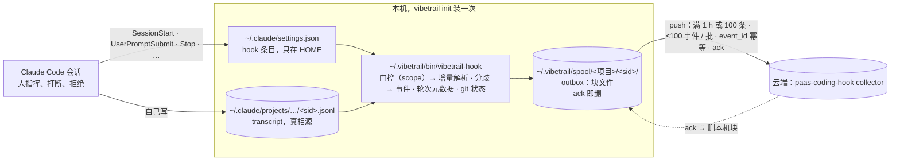

# vibetrail 设计：用 hook 把 Claude Code 会话的两路数据传上云

> **状态**（2026-09-15）：需求与设计定稿；第 1 步「提取器扩展与协议映射」已做（`tools/map-events.jq` + `tools/vibetrail-map`，细则 §4.2），
> 同日对照 Pilot / teamai 补强并定下 U11（只在 Stop / SessionEnd / 补做里解析、从本轮开头读，§3.1、§3.3）；随后分歧一路挂上 hook
> （`tools/vibetrail-hook`：门控、会话锁、state、spool 块文件，§3.3）。同日接着做完 hook 分发入口的其余事件（会话 / 轮次 / 子 agent 起止、
> `ext.claude.*` 事件头、git 状态、commit ↔ 轮次推导，§3.1、§3.5、§4.1）与机器级安装、本地查看（`tools/vibetrail`，§5），沙箱演示
> `experiments/collect-demo/demo.sh`。人机分歧与轮次元数据是同一条事件流（用户 09-15：「以后推的接口是一个，可以不用特意分的特别开」）。
> push 与补充回归场景按用户 09-15 的要求往后放（「push，回归这些都先不急着做」），见 TODO。
> 沿用的判据见 [spec/diverge-v1.md](spec/diverge-v1.md)。G7 之前的代码与测试 09-15 归档到 `old/`，`tools/` 只留新代码。
> 上一版设计（留痕数据投影进被观测仓、git hook 写 `Claude-Session` trailer）已于 2026-09-14 退役，见 §7 D4；仍在用的审计记录线见 §8。
> 2026-09-15 D5：不传 transcript 原文件，正文只随人机分歧事件走，云端定为 paas-coding-hook 事件协议 1.0，索引保留 30 天够用。
>
> 文档分工：本文记**为什么与怎么做**；[CAPABILITIES.md](CAPABILITIES.md) 记**有什么、什么状态**；
> [OPEN-ISSUES.md](OPEN-ISSUES.md) 是**唯一的未完成项清单**；[TODO.md](TODO.md) 记拆解；[third-party/](third-party/) 是三方对照的原始材料。

## 0. 一句话

**机器级装一次**，之后每个 Claude Code 会话由 hook 自动采两路数据——**人机分歧**（打断、拒绝，带能判责的最小正文）和**轮次元数据**
（会话 / 轮次 / 子 agent 的起止、每轮起止的 HEAD 与 commit、状态、token 用量，不带正文）——映射成 paas-coding-hook 事件协议 1.0 的事件，
写进本机 outbox，经 HTTP push 到云端，ack 即删。**不传 transcript 原文件**，非分歧的消息与工具正文、thinking 都不传（§7 D5）。
被观测仓里**零写入**：不进 git、不写它的 settings、不装 git hook、不放运行时。

用户原话，按时间：

- 09-11：「目前先做hook采集两类数据，一类是是pilot全量的这种，但是要采全，可能有些还要补充，然后另一类是人机分歧这种关键数据」
- 09-14：「希望和teamai一样，用hook的方式，一个命令实现安装，然后会自动采集数据」
- 09-14：「我从来没说要放git，我会用hook把他用http的方式传云端」「暂时先不考虑脱敏」「什么时候说实时了，hook触发的时候采集一下，有就传」
- 09-14：「项目级和用户级都要，可配置的，参考teamai，不存git了，不要clone一次装一次，未来会push云端，暂时先缓存本地文件让我看输出内容，保留push动作。然后和teamai一样，装一次就行」
- 09-14：「我们应该也不把hook写进仓，之前的做法不需要」「现在我们的目标就是通过hook把数据传上去，尽量本地不要存太多东西」「如果不是常驻进程，用不到go吧」
- 09-14：「它没说transcript正文要进表吧？你在哪看到的」
- 09-15：「不用传全量的transcript文本，有必要吗」「正文的话，人机分歧先看看能不能带正文吧，其他的先不考虑，不然数据量有点大。如果后面有必要再补充」「数据30天没问题，超过一个月复盘意义不大」「读取不是我们读，我们只负责采，读取分析由其他服务完成」「turn.end 推荐 code，其实是自定义的，不是枚举的，interrupted我们可以直接加」「U1 默认 scope 取 project。意思是项目级别还是用户级别，这个是可配置项把，默认项目级别。参考teamai」

## 1. 要解决的问题

Claude Code 已经把每轮对话、thinking 全文、每次 Edit 的 diff、每条命令的输出、子 agent 的独立 transcript 写在
`~/.claude/projects/<cwd-slug>/<sid>.jsonl`。**问题不是没记**，是：

1. **它只在本机。** 不入仓、换机器即丢；CLI 会话默认 30 天清理，清理在启动时跑（本机 `~/.claude/.last-cleanup` 每次启动刷新），
   可能先于任何事后处理把源删掉。
2. **几百 MB 没有索引。** 本机 40 个主会话 700 MB，单个 106 MB。复盘要找「人在哪一步不同意机器」，得先有索引。
3. **commit 与会话没有关联。** `git blame` 只到行，到不了意图。

复盘要回答两问：**这个 commit 是怎么来的**；**出问题时人和 agent 在哪一步对不上**。答案都在 transcript 里，所以要做的是把答这两问要的那部分
（分歧及其上下文、每轮的 commit 关系）可靠地采出来、送到能查的地方，而不是自建一层采集；读取与分析由别的服务做（用户 09-15）。

## 2. 采什么：分歧带正文，其余只有元数据

| 路 | 采什么 | 正文 | 形态 |
|---|---|---|---|
| **人机分歧** | [spec/diverge-v1.md](spec/diverge-v1.md) 的 5 类 kind，映射成协议事件（§4.1） | **带**能判责的最小上下文：被拒调用的工具输入（命令 / 编辑内容）与拒绝原文；被打断的那条模型回复与打断后人的下一句 | 事件，每条 KB 级 |
| **轮次元数据** | session / turn / subagent 的起止事件；每轮起止的 HEAD、分支、脏否与 `rev-list` 出的 commit（§3.5）；轮次状态、model、token 用量；**调用 trace**（09-15 加，D8）：每次模型调用一条（model、这次的 token、stop_reason、调了哪些工具、请求起止），每次工具调用一条（工具名、成功 / 出错 / 取消、耗时）；`InstructionsLoaded` / `CwdChanged` / `StopFailure` 等 hook 事件头（事件名、时间、`tool_use_id`、错误类型、reason、`agent_id`） | **不带**：非分歧轮次的消息、工具输入输出、thinking、system prompt、CLAUDE.md 正文都不传 | 事件，每轮几条到几十条、每条百字节级 |

**不传 transcript 原文件**（§7 D5）。两路按会话 id 关联——transcript 文件名与 hook 的 `session_id` 是同一个值——走同一条通道。分歧一路的提取仍是
diverge-v1 那份 jq，转成事件是它之后的一步。「后面有必要再补充」的口子留着：协议的 message.* / tool.* 与 ext.* 事件都在，要补正文时只是多映射几类记录，
采集端不用换形态。

### 2.1 「采全」的定义：人类侧一条不漏，靠条数对账

上一版把「采全」定义成 transcript 逐字节复制上云，为的是躲 Pilot 的坑；2026-09-15 用户否掉（数据量大，两问用不上），见 §7 D5。
现在「全」只对分歧成立：**人类侧每一条打断、拒绝都进事件**，钉子是每类 transcript 记录进多少条、出多少条事件（A2、A11），不是字节相等。
Pilot 的坑照样要防：它把 transcript 规范化成事件，模型与工具一侧全、人类一侧漏——打断 265 条只进 5 条，每轮第一条人类输入
1,599 条丢 154 条（[Pilot 采集清单 §1.2b](third-party/loongsuite-pilot-collection.md)）。根因是它按 promptId 分轮、只读 `user` / `assistant`
两种记录，而原始 transcript 里的记录类型远不止这两种。解析器要按记录逐条走、不按轮分组。本机清单（2026-09-14，40 个主会话 / 676 个子 agent 文件 / 700 MB，
Claude Code 2.1.142–2.1.266，入口全是 claude-desktop），标出人类侧记录在哪：

| 顶层 `type` | 条数 | 里面是什么 |
|---|---:|---|
| `assistant` | 54,260 | 模型回复：text / thinking / tool_use，`usage`、`requestId`、`model` |
| `user` | 28,258 | 人的输入、tool_result（`toolUseResult` 里有 Bash 的 `stdout` / `stderr` / `interrupted`，Edit 的 `structuredPatch` / `originalFile` / `oldString` / `newString`）、打断标记 |
| `attachment` | 13,632 | 40 种子类型，见下 |
| `last-prompt` / `ai-title` / `custom-title` | 7,864 / 7,169 / 4,361 | 会话元数据：最后一条 prompt 原文、标题 |
| `queue-operation` | 6,444 | 人排队的消息：enqueue 3,237 / dequeue 2,314 / remove 893，remove 里 296 条带 `reason: absorbed_mid_turn`（人在模型干活时插话，被并入当前轮） |
| `mode` | 5,748 | 模式切换 |
| `system` | 2,995 | `stop_hook_summary` 2,084（每次 Stop 跑了哪些 hook、报没报错）、`api_error` 860、`compact_boundary` 48、`local_command` 2、`model_refusal_fallback` 1 |
| `atis-latch` / `bridge-session` | 2,397 / 1,323 | 远程桥接；`bridge-session` 带 `ownerAccountUuid`、`ownerOrganizationUuid`——**身份类** |
| `worktree-state` | 1,039 | desktop 给会话开的 worktree：`originalCwd`、`worktreePath`、`worktreeBranch`、`originalHeadCommit` |
| `file-history-snapshot` / `file-history-delta` | 45 / 14 | 2.1.260 起的文件检查点：每轮一份快照、每次 Edit / Write 前一份备份指针，正文在 `~/.claude/file-history/<sid>/<hash>@vN`，是整份文件（本机 952 KB） |
| `frame-link` | 2 | — |

`attachment` 的 40 种子类型里与本项目有关的：`prompt_snapshot` 38（system prompt 与全部工具定义，§6.3）；`hook_blocking_error` 332 /
`hook_success` 9 / `hook_cancelled` 1（hook 的结果，含命令与 stdout）；`edited_text_file` 327（Read 过的文件在磁盘上被改了——抽样都是 agent
自己的命令改的，不是人）；`queued_command` 713（排队的人话原文，`origin.kind: human`）；`command_permissions` / `auto_mode` / `auto_mode_exit`
34 / 34 / 1（权限模式）；`instructions` 17 / `nested_memory` 7（加载的 CLAUDE.md）；`skill_listing` 102 / `mcp_instructions_delta` 105 /
`environment` 82 / `session_context` 24（拼 system prompt 用）。其余是提醒类：`total_tokens_reminder` 8,333、`task_reminder` 2,397……

分歧相关的人类侧记录只在 `user`（打断标记、`is_error` 的拒绝正文）与 `queue-operation`（插话）里；其余类型是元数据或旁证，D5 后不传。
规范化成事件的风险（Pilot 重走一遍）靠两条挡：判据只认字段不 grep 原文（diverge-v1 §4），条数进出对账（A2）。

### 2.2 对照 Pilot：哪些进事件、哪些不进

| Pilot 漏的 / 我们要的 | transcript 里在哪 | D5 后怎么处理 |
|---|---|---|
| 打断记录（265 → 5） | `user` 记录的 text 块 | 进 `turn.end`（code `interrupted`）；子 agent 文件里的进 `subagent.end`（`cancelled`）；带被打断的回复与打断后的人话 |
| 每轮第一条人类输入（1,599 → 1,445） | `user` 记录 | 轮次本身进 `turn.start` / `turn.end`（元数据）；正文只在被打断的轮次带 |
| 被拒与执行失败分不开 | 拒绝正文在 `is_error` 块里，判据在 diverge-v1 | 人拒 / 分类器拦 / 链路故障进 `permission.decision`（decided_by 区分），执行失败才是 `tool.end(failed)`；hook 侧另有类型化的 `PostToolUseFailure`（不含权限拒绝）与 `PermissionDenied`（只在 auto mode），见 §3.2 |
| 被拒调用的输入（命令 / 编辑内容） | 前一条 assistant 记录的 `tool_use` 块，按 `tool_use_id` 反查 | 进被拒调用的 `tool.request.input`，同时得到 `tool_name`（G5 前置） |
| Edit 的 `structuredPatch` / `originalFile`，Bash 的 `stdout` / `stderr` | `toolUseResult` | **不传**（非分歧正文） |
| `uuid` / `promptId` / `requestId` | 有 | `event_id` 从记录 uuid 派生（§4.2），`turn_id` = promptId。打断记录也带 promptId（09-15 抽样 277 条全带，原以为「常没有」是错的）；缺失时按位置推、provenance 标 inferred，fixture 钉着 |
| system prompt、CLAUDE.md 正文 | ≥ 2.1.258 有 `prompt_snapshot`；`InstructionsLoaded` hook 给路径 | **不传**；`InstructionsLoaded` 只记路径与 sha 的事件头。「有必要再补充」 |
| **git 状态**（HEAD、工作树） | **没有** | hook 侧富化：UserPromptSubmit / Stop 各记一次 HEAD、分支、脏否，进 `turn.start` / `turn.end` 的 vcs；worktree 根与脏文件数放 extensions。逐次工具调用的工作树是 G11 的事 |

## 3. 怎么采：只用 hook

**边界**：只有 Claude Code 的 harness hook。不常驻守护进程、不改 shell rc、不注入进程、不改写用户命令、不装 git hook、不往被观测仓写任何东西。
Pilot 的拦截器路线（[对比 §6.3](third-party/teamai-cli-vs-vibetrail.md)）已否；system prompt 新版 transcript 自带快照（§6.3），不需要拦截。

### 3.1 事件与动作

| 事件 | 动作 | 同步 / 异步 |
|---|---|---|
| `SessionStart` | 门控（按 scope，§5）→ 发 `session.start`（`source`、capabilities；model、git 状态进 extensions）→ **补做**：本仓（按 `git worktree list` 归属）所有 offset 落后于文件大小的 transcript，各补一次解析（分歧 + 轮次元数据）；同一会话 `resume`、别的会话空闲超过 `turn_idle_close`（默认 3600 s）时把它的最后一轮也关掉（D7）；然后 **push 全机待发、不看门槛**（只看退避期，§4；push 未做）。startup / resume / clear / compact 都触发，频率不低，是最靠得住的兜底：agent 崩溃、被杀、`-p` 模式下 Stop / SessionEnd 都不来，全靠这一步 | 同步 hook，但读完 stdin 就把门控、记录、补做全丢进脱离的后台进程，自己约 0.02 s 退出（09-15 实现时定：不让人等） |
| `UserPromptSubmit` | 发 `turn.start`（`prompt_id` 作 turn_id、会话已知的 model、HEAD / 分支 / 脏否，提示来源 `source` 进 extensions），记轮起快照（§3.3 `turns/`）；上一轮没等到 Stop 的（打断、拒绝、崩溃），用此刻的快照给它补一份「止」（gap）。**不读 transcript**（U11，09-15 定）：这里解析的结果本来也不 push、云端看到的时间不变，同步 hook 却要让人等；Pilot、teamai 也都不在这里读 | 同上：丢后台、立刻退出；stdout 会进模型上下文，**必须为空** |
| `Stop` | 记轮止快照与本轮 commit（§3.5；被别的 Stop hook 拦停后同一轮会再来一次 Stop，每次覆盖、`stops` 计次）→ 等 transcript 写稳 → 从本轮开头解析（§3.3）：分歧事件 + **本轮的 turn.end**——Stop 就是模型答完，当场关（D7；Claude Code 的答完标记 `stop_hook_summary` 落盘了就按它关、没有才按 Stop 关——09-16 在 desktop 2.1.270 上实测它与 Stop 同一秒落盘，见 D7 的 09-16 补记）；被别的 Stop hook 拦下时再来一次 Stop，再发一条更新的 → 落 spool，再**看门槛决定推不推**（D6，09-15 定，规则在 §4；push 未做）：全机最早待发事件超过 1 小时、或全机待发满 100 条，任一满足且不在退避期就推，推的是全机所有待发、不只本会话；都不满足就只落盘，本轮不发；端点未配置时只记账不发。同一会话一把 mkdir 锁（照 Pilot），已在跑就跳过，下一次 hook 补上；push 另持一把机器级锁（§4） | `async: true`：不阻塞、不计 timeout |
| `SubagentStart` / `SubagentStop` | 发 `subagent.start` / `subagent.end`（`agent_id` 作实例 id、`agent_type`、父实例：一级是 `main`，被子 agent 派出的是 meta.json 的 `toolUseId` 所在的兄弟文件；`parent_call_id` 取 meta.json 的 `toolUseId`，09-15 实跑 SubagentStart 时 meta.json 已经在）；Stop 时再扫一遍 `subagents/` 目录——后台子 agent 在父 Stop 之后才结束 | 异步 |
| `PostToolUseFailure` / `PermissionDenied` / `StopFailure` / `Notification`（`permission_prompt`、`idle_prompt`） | 只记事件头，发 `ext.claude.<事件名的 snake_case>`：`tool_use_id`、`tool_name`、`is_interrupt`、`reason`（≤ 1 KB）/ `error`（StopFailure 的错误类型）/ `notification_type`、时间。PostToolUseFailure 的 `error` 原文是工具输出，只记字节数（D5）。StopFailure 另记进本轮，关轮时 status 取 error。`is_interrupt` 为 true 时等打断记录落盘后当场解析（二进制里工具抛出中止错误的路径会置 true；desktop 里按停止**不走这条路**，实测没有触发，见 D7）。`idle_prompt` 不发事件，只补一次解析（CLI 交互界面空闲时发，desktop 实测不发）。类型化信号，见 §3.2 | 异步（09-15 实现时改：只记事件头，不必让工具调用等） |
| `InstructionsLoaded` | 记 `file_path`、`memory_type`、`load_reason`、正文 sha256 与字节数；正文不传（D5，有必要再补） | 异步 |
| `CwdChanged` | 记 `old_cwd` / `new_cwd`（G11 接手检测的同一挂载点） | 异步 |
| `SessionEnd` | 发 `session.end`（`reason`、status），给最后一轮补「止」快照（没等到 Stop 的话）→ 解析并关掉最后一轮（`closed_by` = `session_end`）→ 起一个脱离当前进程的后台 push（push 未做），**不看门槛**、只看退避期，自己不等结果。预算 1.5 s（`CLAUDE_CODE_SESSIONEND_HOOKS_TIMEOUT_MS` 可抬）只够落 spool 与 fork，一次网络请求不一定来得及；后台进程在 `-p` 下活不活、desktop 里长开几天的会话什么时候触发 SessionEnd，都没实测。所以它只是弱兜底，来不及的交给下一次 SessionStart 补做 | 同步 hook，全部丢后台、立刻退出（不受 1.5 s 预算限制） |

不挂 `PreToolUse` / `PostToolUse`：每次工具调用多跑一个进程，而它们给的 `tool_input` / `tool_response` transcript 里全有，且 D5 后除被拒调用的输入外都不传。
hook payload 里的 `tool_input` / `tool_response` 也不另存一份——transcript 全有。Pilot 的输出里每份内容出现 3 次（`tool.call`、`llm.response`、
下一次 `llm.request` 的输入增量各一份），就是同一内容多处存的下场。

**什么时候读**：Stop、SessionEnd、SessionStart 补做，以及 PostToolUseFailure 带 `is_interrupt`、空闲（`idle_prompt`，desktop 不发）时读 transcript，
有新的就提取、就传（用户原话「hook触发的时候采集一下，有就传」），没有实时的要求。用户按停止打断时没有任何 hook（desktop 实测），打断记录等到下一个 hook 读到；
offset 只在解析成功后前移，所以只是晚到，不会漏。`transcript_path` 是异步写的、可能落后于内存里的对话，Stop 时先等 `stop_hook_summary` 落盘再读（D7）。

**什么时候推**（D6）：不是每轮推。Stop 落完 spool 看门槛，全机最早待发超过 1 小时或全机待发满 100 条才推；SessionEnd 与 SessionStart 补做不看门槛。规则、退避与锁在 §4。

### 3.2 分歧一路为什么还是要读 transcript

两类人的分歧都**没有 hook 事件**（官方文档，2026-09-14 核）：Stop 在用户打断时不触发（「They don't fire on user interrupts」）；权限被人拒
只有 PreToolUse、没有任何结束事件——`PostToolUseFailure` 明写不含权限拒绝，`PermissionDenied` 只在 auto mode 发。所以 `interrupt` /
`permission_denied` 仍靠 diverge-v1 读 transcript 的字符串判据，脆弱性不变（G6）。

机器一侧倒有了类型化来源：`PermissionDenied`（≈ `classifier_blocked`）、`PostToolUseFailure`（工具失败，不是分歧）、`StopFailure`（API 错，
带 `error` 类型）。hook 事件流记下它们的 `tool_use_id`，就能和 transcript 里的字符串判定对账——两边对不上就是判据漂了，这正是 G6 要的哨兵。

### 3.3 增量解析与本机 outbox

- 每个会话一个 state 目录 `~/.vibetrail/state/<sid>/`，里面每份 transcript（主文件 `main`、子 agent `agent-<id>`）各一份
  `<名>.json`：读到的行号与字节（`lines` / `consumed_bytes`）、下次起读的 `checkpoint_line` / `checkpoint_byte`（本轮开头）；
  各一份 `<名>.seen`：触发记录与人话记录的 `uuid<TAB>行号`（认回放副本用，§4.2；行号按文件算，所以按文件分开存）；
  会话级一份 `ids`：已写进 spool 的 event_id。每次只解析到源文件**最后一个换行符**为止（源可能正在写半行）。不复制文件，按字节偏移跳读。
  实现 `tools/vibetrail-hook`（共用函数 `tools/vibetrail-lib.sh`），回归 `tools/test-hook-flow.sh`（scenario 回放，25 项）。
- **轮次证据**（09-15）：`state/<sid>/turns/<turn_id>.{start,stop,gap,fail}.json`。UserPromptSubmit 记轮起快照（同一 prompt_id 再来一次不覆盖，
  轮起 HEAD 取第一次）；每次 Stop 覆盖一份轮止快照与本轮 commit（`stops` 计次、`stop_hook_active` 照记）；没等到 Stop 的轮，在下一轮开始或会话结束时
  用那一刻的快照补一份 gap；StopFailure 记 fail。映射层关轮时读它们（`vibetrail-map --hook-turns`）。一种证据一个文件：同步 hook 不拿会话锁，
  分文件写就不会互相覆盖。Stop 快照早于轮起快照的不算这一轮的 Stop（斜杠命令 `/model` 之后也会来一次 Stop，而之后那句人话沿用同一个 promptId）。
  `last_turn` 记 hook 最近开的一轮，`session.json` 记 model 与 source；两周前的轮次证据在补做时清掉。
- **从本轮开头读，不从文件头读**（U11，09-15 定）。映射要回看的东西都在同一轮里，所以只重读本轮：106 MB 的会话一次从 10.5 s
  降到 0.19 s；676 轮里九成不超过 0.4 MB。借的是 Pilot「只读新字节」的思路，但它不保留上下文、全靠 Stop 恰好切在轮边界，
  我们退到本轮开头，边界落在轮中间也不丢上下文。首次整读仍是 O(文件)，106 MB 约 12 s，只发生一次、在后台。
- **offset 信任检查**（重写守卫，照 agentsview 的思路，[调研](third-party/open-source-survey.md)）：state 里记文件指纹「inode : 开头 4 KB 的 sha1 :
  已消费位置前 4 KB 的 sha1」。换了 inode、文件变短、两段哈希任一变了，都算被重写过：从 0 重读，清掉这份文件的 state 与 `.seen`，`ids` 留着——
  重读出的同一批事件在写 spool 前按 event_id 拦下；state 的 `rewrites` 计次数，给 doctor 看。agentsview 哈希整个前缀，我们只哈希两小段，
  保住「从本轮开头读」的代价；没有新字节时只比 inode、不算哈希（一个会话几十个子 agent 文件）。代价写明：只改了中间、大小又不变的原地改写查不出来。
  transcript 目前是 append-only，但 `file-history-snapshot` 带 `isSnapshotUpdate` 字段，不能假设永远是。
- 首次全读、无单次上限。Pilot 首次只读最后一轮、单次超过 50 MB 只读尾部，那份 111 MB 的会话前段整个丢掉，4 条拒绝没了；
  teamai 超过 50 MB 整份不扫。两种上限都会丢分歧，不学。
- 子 agent 文件按 `<sid>/subagents/` 目录扫，不只信 hook 递来的那一个路径——teamai 栽在这里，58% 的人拒在子 agent 文件里
  （[对比 §3.2](third-party/teamai-cli-vs-vibetrail.md)）。
- 产物写临时文件 + 原子 rename；每个会话一个目录，多 worktree 并发不共享文件。同一会话的几次 hook 可能重叠（大会话首次整读约 12 s，
  轮次比它短），用 `state/<sid>/.lock`（mkdir 原子锁，照 Pilot；陈旧阈值 300 s）挡住，已在跑就跳过，下一次 hook 补上。
  失败日志 `logs/errors.log` 只留元数据（时间、事件、会话、阶段、退出码），不留 payload（teamai 上报失败把整份 context 连 prompt 摘要写盘，别学）。
- **本机不是存档，spool 是过手的 outbox**：push 在产出数据的同一个 hook 里发（Stop 异步、按门槛；SessionEnd 与 SessionStart 补做不看门槛，§4），服务端 ack 即删；本机常驻只有
  `state/`（offset、push 水位与退避记录，KB 级）与还没 ack 的块。任何一条事件在本机最多待约 1 小时加到下一次 hook 的间隔。端点未配置的现阶段它才是「全部」，文件可读、不压缩，就是用户要先看的「输出内容」。
- 布局：`~/.vibetrail/spool/<项目键>/<sid>/` 下是**块文件**：每次 hook 产出一块 `<UTC 时间>-<pid>-<名>.jsonl`（协议形状的事件，每行一条），
  临时文件 + rename 写入，写入后不再改；push 按块发、ack 后整块删，不用改写一个不断增长的 `events.jsonl`（09-15 改，原写法是单个 events.jsonl + manifest.json）。
  块名里的 UTC 时间就是门槛计时的依据（§4）：最早待发事件的时间直接从文件名取，不另记状态。
  offset 等进度在 `state/`（上一条），不放 spool。项目键 = 主 checkout 目录名 + 路径 sha1 前 16 位。
  `project_id` 取 `origin` 远端（去掉协议、用户名和 `.git`），没有远端就用主 checkout 路径；`workspace_id` 取主 checkout 路径（§4.1）。
  不再有副本目录；分歧提取器的原始输出是中间产物，A3 拿它对账。
  批次按协议打（≤ 100 条 / 16 MiB），一批可以混多个项目、多个会话（batch 顶层只有 `schema_version` / `batch_id` / `client` / `events`，项目与会话 id 在每条事件上，09-15 核），
  不另立 spool spec，事件形状以协议 schema 为准（[原件进仓](third-party/collection-batch-1.0.schema.json)作回归输入）。

### 3.4 hook 纪律

`exit 0`；stdout 为空（SessionStart / UserPromptSubmit 的 stdout 会进模型上下文）；每条显式 `timeout`；命令用绝对路径、不依赖 PATH——
desktop 启动的 hook 拿到什么 PATH 未测，jq 的绝对路径由 init 写进配置（§5.3）；`-p` 模式下 async hook 在会话结束时被杀，靠下一次 SessionStart
补做兜底；所有 hook 并行跑，与被观测仓自己的 Stop hook（agentDock 有三个）互不等待。每条记录带 Claude Code 版本与 `hook_event_name`——
判据靠英文串、`prompt_snapshot` 只在 ≥ 2.1.258、hook 事件集随版本变（文档列 30 余种，2.1.260 bundle 里 33 种），同一台机器 CLI（2.1.12）
与 desktop 自带（2.1.266）并存；doctor 报版本与未知事件。

### 3.5 commit ↔ session：从每轮起止的 HEAD 推，不再靠 trailer

UserPromptSubmit 记轮起 HEAD，Stop 记轮止 HEAD，并记 `git rev-list <起>..<止>`（一轮多 commit 也全在）；起不是止的祖先时（rebase / reset）
改记这段时间内 reflog 新增的 sha；Bash 的 `git commit` stdout 里的短 sha 作旁证。人在别的终端提交会被算进当轮，靠 committer 与 transcript 里
有没有对应的 Bash 调用区分，标 `inferred`。失去的只有一样：`git log` 里不用工具就能看到会话 id。这条推导替代了上一版的
`Claude-Session` trailer（§7 D4）；它记的仍是「哪个会话执行了提交」，「每一行出自哪个会话」是 G11 的事。落到协议里是 `turn.start` / `turn.end` 的
`vcs` 快照与 `turn.end.commits[]`（完整 sha、`relation=observed`、evidence `before_after`；Bash stdout 里的旁证走 `tool_result`）。

实现（09-15，`tools/vibetrail-lib.sh`）：`vt_git_snapshot` 取 HEAD（完整 sha）、分支、脏否与改动文件数，全程 `GIT_OPTIONAL_LOCKS=0`——`git status`
会顺手刷新并写回 `.git/index`，被观测仓零写入（A8）不许；status 限时 3 s，超时就不报脏否。`vt_commits` 算本轮 commit =
`rev-list <现在的 HEAD> <本轮 reflog 里 commit / merge / cherry-pick / revert / rebase / am 留下的 sha…> ^<轮起 HEAD>`（≤ 256 条）：起是止的祖先时就是
`rev-list 起..止`；rebase / reset / 切分支后又提交时，reflog 那一路把新提交补回来，切到已有分支不会被算进来。extensions 记
`vibetrail.commit_method`（`rev-list` / `reflog`）与 `vibetrail.commit_attribution`：本轮 transcript 里 agent 自己用 Bash 跑过 `git commit` 是
`agent_tool`，否则 `inferred`（人可能在别的终端提交）。轮起快照缺失（这一轮开始时还没装 hook）就不报 commits。Bash stdout 里的短 sha 旁证还没做。

### 3.6 流程

被观测仓不在图里：它里面什么都不写。

## 4. 去哪：本机 outbox → HTTP push 到 paas-coding-hook collector

| | 事件（分歧 + 轮次元数据，同一条通道） |
|---|---|
| 去向 | **云端已定**（§7 D5）：paas-coding-hook 事件协议 1.0 的 collector，`POST /api/v1/collection/batches`（[协议意见](third-party/paas-coding-hook-protocol-feedback.md)）。现阶段端点还没有：spool 里的事件就是将来 push 的内容，先让人看；push 动作第一版就在，端点未配置时不发只记账。**不进 git**；读取与分析不归本项目 |
| push 怎么传 | 端点与 token 在 `~/.vibetrail/config` 里配，没配就不发（spool 完整保留，`vibetrail push --list` 看待发清单）。配了：按协议打批，≤ 100 条 / 16 MiB，单条 ≤ 1 MiB，超限不截断、整条拒收，要计数告警；`event_id` = UUIDv5(会话 id, 记录 uuid, 事件种类)，重发幂等；服务端返回 accepted + duplicate 后推进 push 水位并删本机块；失败留 spool，按下面两行的规则重发；失败日志只留元数据。索引在 MySQL 事务提交后才返回，正文 Span 尽力投递，接受偶发丢正文（分歧的事实在索引里）。请求暂不支持压缩（已提意见）。仍未定：端点地址、token 怎么发与续期（U4） |
| push 什么时候发 | **不是每轮推**（D6，用户 09-15 定）。Stop 落完 spool 查两个门槛，任一满足就推：**全机最早待发事件超过 1 小时**，或**全机待发满 100 条**（正好一整批）。两个值在 `~/.vibetrail/config` 里可改（`push_max_age`，默认 3600 s；`push_max_events`，默认 100）。计时从最早待发事件算、不从上次推送算：保证的是「任何事件在本机最多待约 1 小时加到下一次 hook 的间隔」，时间就在块文件名上、不另记状态，空闲之后窗口从第一条事件起算、批更满。**按整台机器算、不按会话算**：一次 push 扫全部 `spool/<项目>/<sid>/`，合在一起打批（协议允许混批，§3.3）；并行开几个会话时各数各的谁都攒不满。待发超过 100 条就循环发，发完或失败为止，一次最多 10 批、剩下的下一次 hook 接着发（SessionStart 补做后常一次上千条）。**兜底不看门槛**：SessionEnd 起后台 push、SessionStart 补做后 push，都只看退避期。没有 daemon，「满 1 小时」的实际含义是「超过 1 小时后的第一个 hook 才推」，不是每小时推一次；人空闲时既没有新事件也没有 hook，攒下的最后几条要等下一次 hook 或下一次开会话——与 teamai 等到下一次 pull 才上报是同一类最坏情况，只在边角出现。push 持一把**机器级 mkdir 锁** `state/push/.lock`（与会话锁同款，已在跑就跳过），作用是省请求与账好对，不是保正确：块文件写入后不变、ack 后删块幂等，两个 hook 同时推同一块只会多发一次、服务端答 duplicate。锁的陈旧阈值单独定为 600 s：一次最多 10 批、每批 curl 超时 30 s，会话锁的 300 s 不够 |
| push 失败怎么办 | 分两类，照 agentsview 的思路（[调研](third-party/open-source-survey.md)）。**暂时失败**（连不上、超时、5xx，以及 401 / 403 这类配置问题）：块留 spool，失败时间与次数记在 `state/push/`，退避期内**所有触发点都不发，含 SessionEnd / SessionStart 的兜底**（resume、clear、compact 都触发 SessionStart，端点挂掉时不看退避就是每次 compact 打一次注定失败的请求）；退避从 1 分钟起指数增长、封顶 1 小时，与时间门槛同量级；客户端超时但服务端已收下的，重发得到 duplicate，正是 `event_id` 幂等要挡的情况。**永久失败**（4xx 里的内容问题：schema 不过、单条超 1 MiB）：拒单条还是拒整批协议资料没写，按拒整批准备——整块挪到 `spool/.rejected/`、计数、doctor 报出来，**不重试**；否则它卡在队头，后面所有事件都推不出去。401 / 403 也进 doctor |
| 保留 | 端点未配置前 spool 积着（上限与超限策略 U5，倾向只警告不丢）。配置后 **ack 即删**，不留 N 天。云端索引保留 30 天，**够用**（用户 09-15：「超过一个月复盘意义不大」）。仍要在会话自己的 Stop / SessionEnd 里落 spool，SessionStart 补做只是兜底——transcript 清理可能先于 hook 把源删掉 |
| 体积 | 分歧事件带被拒命令与被打断的回复，单条通常远小于 1 MiB。~~元数据每轮几条、百字节级，每会话 KB 级~~ **09-16 改**：D8 的调用 trace 让每轮变成几十到几百条——本机 45 个会话 120 MB、124,666 条，trace 占 95%，每会话 MB 级、最大的会话约 50,000 条（`5f069818`：23,147 次模型调用、26,307 次工具调用）。push 的门槛（D6）、spool 上限（U5）、云端 30 天的量都按这个算。上一版 700 MB 字节流的分块与压缩问题随 D5 消失 |
| 隐私 | 出本机的正文只剩：被拒调用的工具输入与拒绝原文、被打断的模型回复、打断后人的下一句。可能含命令里的密钥与代码片段。**暂不脱敏**（用户 09-14，K6），先原样传。云端「记录默认对公司已登录用户可见」（协议与 collector 文档），是目前唯一的闸而且是开的，已提意见 |

### 4.1 映射到协议 1.0

| 我们的 | 协议事件 | 关键字段 |
|---|---|---|
| `interrupt` | `turn.end`，status code `interrupted` / category `cancellation`，detail 是标记原文 | `turn_id` = promptId（打断记录带；缺失才按位置推、provenance 标 inferred）。正文：沿 `parentUuid` 回溯到最近的 assistant 记录，再按 `message.id` 拼回整条回复（§4.2）——有文字发 `message.assistant`，有 `tool_use` 发 `tool.request`（在跑的调用）；打断后人的下一句发 `message.user`（delivery `direct`）。payload 另带 model、本轮 usage、vcs.branch |
| `permission_denied`（+ 伴随的 `interrupt_for_tool_use`，n:1，计一次） | `permission.decision`，decision `deny`，decided_by `user`，`permission_id` = `call_id` | `tool_name` 必填：`The user doesn't want to proceed` 形态里没有工具名，用 `is_error` 块的 `tool_use_id` 反查 `tool_use` 块的 `name`（G5 已关）→ 反查不到退 `Permission to use (\S+)` 捕获 → 再退 `unknown`，来路记 `extensions.vibetrail.tool_lookup`。正文：反查到的 `input` 发一条 `tool.request`；拒绝原文放 `reason`（≤ 4096）；拒绝后人的下一句也发 `message.user`（与打断同款——判责要的就是这一句，比 §2 多带一句）。for-tool-use 记录被吸收不另发；同一轮没有拒绝可配的按打断发、detail 标 unpaired |
| `classifier_blocked` | 同上，decided_by `policy` | 同上 |
| `permission_infra_fail` | 同上，decision `error`，decided_by `system` | 同上 |
| 子 agent 文件里的打断 | `subagent.end`，status `cancelled` | 父会话那条是 `turn.end`，两个事实，不去重（K1 关闭）；统计打断只数 `turn.end` |
| 轮次 | `turn.start`（model、vcs）/ `turn.end`（status、usage、vcs、commits[]） | `turn.start`：UserPromptSubmit 当场发（provenance `hook`）；hook 没跑的轮由映射层按 promptId 补位（同一 event_id，先写的留下）。`turn.end`：**模型答完就发**（D7）——Stop hook 当场关（`closed_by` = `stop`），被拦下后再 Stop 时补发一条 `stops` 更大的；重读到 `stop_hook_summary` 且之前没有拦停反馈也关（`summary`）；拒绝后停下的在 for-tool-use 打断处关（`denied`）；打断的由分歧一路发 `interrupted`；没有标记的退到兜底：下一轮开始、会话结束（`session_end`）、同会话恢复（`resume`）、空闲超过 `turn_idle_close`（`idle`）。status：summary / hook 记到的 Stop / 最后一条回复 `end_turn` 是 `completed` / `success`，`preventedContinuation` 是 `hook_stopped` / `cancellation`，拒绝是 `denied` / `denial`，只有 StopFailure 是 `<错误类型>` / `error`，没有证据是 `unknown` / `unknown`；依据记在 `vibetrail.end_evidence`。usage 与打断同一定义（§4.2）；vcs、commits 取 hook 快照（Stop 优先，其次 gap）；打断的 turn.end 也补上这两样 |
| 会话、子 agent | `session.start`（source、capabilities）/ `session.end`（reason、status）/ `subagent.start`（agent_type、父实例、`parent_call_id`）/ `subagent.end` | hook payload 直接给。capabilities 暂填我们会发的事件类型清单、session.end 的 status 填 `completed` / `success`、reason 按 code 规范化——都是自定义取值，接 collector 前确认（U13） |
| hook 事件头 | `ext.claude.<事件名的 snake_case>`（如 `ext.claude.post_tool_use_failure`），provenance `hook` + `source_event` | `InstructionsLoaded` 只带路径、sha256 与字节数；PostToolUseFailure 的错误原文是工具输出，只带字节数 |

Schema 硬规则（[collection-batch-1.0.schema.json](third-party/collection-batch-1.0.schema.json)）：枚举类字段全是小写 `code` 型；`permission.decision` 必填
`permission_id` / `tool_name` / `decision` / `decided_by`；`provenance.kind=transcript` 必带 `rule_version`；`files[].evidence=tool_argument` 只能是
`target` / `read`，说「改了」要 `tool_result` 或 `before_after`；路径必须在工作区根内、不能 `..`（跨仓改动 K2 没有表达法）；`commits` 只能挂 `turn.end`、
非空、完整 sha；`ext.*` 必带 `provenance.source_event`；thinking 不能当 assistant 文本。`client.name` 是 const `paas-coding-hook`，先照填（已提意见），vibetrail 自己的版本放 `extensions.vibetrail.version`；`policy_version` 填 `none-0` 表示暂不脱敏（两个默认值用户 09-15 认可）。
`workspace_id` 取主 checkout（`git worktree list` 第一条），与 G8 的分区键一致，worktree 路径放 extensions。

### 4.2 映射细则

实现 `tools/map-events.jq`（include 判据模块 `diverge-rules.jq`），驱动 `tools/vibetrail-map`（填 `event_id`、出账本），
回归 `tools/test-map.sh`（11 份 fixtures + scenario 回放；断言 + golden + schema + A2 对账 + 每个切点的增量等价 + event_id 用 python 独立重算）。

- **触发与派生。** 每条分歧命中是一个触发记录；它派生出的事件（被拒调用的 `tool.request`、被打断的回复、之后人的下一句）
  都挂在触发记录上：`extensions.vibetrail.trigger` / `vibetrail.after` 指回触发记录的 uuid，`vibetrail.kind` 记原始 kind，
  `raw` 保留提取器的原始命中（A3 对账用），`provenance.source_event_id` 是事件自己来源记录的 uuid。
- **增量：从本轮开头读，按行号门控。** 每次从上次账本的 `checkpoint_line`（本轮开头；还有没等到人话的分歧时退到那个分歧所在轮的开头）
  读到最后一个换行符，只对**触发记录**行号 > 上次 `lines` 的分歧发事件；索引（tool_use、`parentUuid` 链、当前轮）在这一段里重建。
  派生事件按 `_key` 去重，**登记不看门控**。「前段 + 从 checkpoint 起的后段」与一次扫全文发出的事件相同：fixtures 每个切点钉着，
  本机 44 个主会话各三个切点实跑一致（09-15）；把 checkpoint 改成「上次读到哪就从哪读」的变异在 8 份 fixtures 上都被抓到。
- **回放副本不上报**（用户 09-15）。Claude Code 会把旧记录原样再追加进同一个文件：uuid、时间戳不变，只把 promptId 改成回放时那一轮的。
  本机 44 个主会话里 4 个有，共 1402 条。不跳过的话，副本里的打断会再报一次，还会把回放之后人打的第一句挂成它的「下一句」。
  规则只管会产生事件的两种记录（触发记录、人话记录）：本次读取里 uuid 出现过的跳过；uuid 在 state 的 `[uuid, 行号]` 清单里但行号
  对不上的跳过，对得上的是正常重读。不用「时间戳倒退」判：真实触发记录 405 条从不倒退，但真实 user 记录有 63 条倒退超过一分钟。
  Pilot、teamai 都不处理这种副本：Pilot 只在一条消息内按工具调用 id 去重，teamai 只按消息 id 给 token 去重。
- **`event_id`** = UUIDv5(uuid5(NS_URL, "vibetrail") = `6c90e594-0cb4-59d0-9186-740d215c8b7f`, "`<sid>|<记录 uuid>|<事件类型>|<限定符>`")，
  限定符是 `call_id` / kind；同一输入重跑同一个 id，重发幂等靠它。所有名字一次交给 `shasum` / `sha1sum` 算完，运行时不引入 python；
  测试里用 python 的 `uuid.uuid5` 独立重算核对（09-15 发现先前的命名空间常量误用了测试串算出的值，未发布过，已改正）。
- **`turn_id`** = 记录的 promptId；没有就取最近见到的 promptId，再没有就用记录 uuid，后两种 provenance.kind 标 `inferred`（带 `rule_version`）。
  派生事件跟触发记录的轮次走。
- **实例。** 主会话 `agent_instance_id` = `main`；子 agent 文件里 = `agentId`（每条记录都带），`parent_call_id` = 同名 `meta.json` 的 `toolUseId`，
  `agent_type` 取 `agentType`；`session_id` 都是父会话 id（文件名 / 上两级目录名）。`parent_agent_instance_id`：一级子 agent 是 `main`；
  被子 agent 派出的（`spawnDepth` ≥ 2，本机 80 个，76 个有 transcript）是派它的那个子 agent——在兄弟文件里找 `toolUseId` 所在的
  `agent-<id>.jsonl`，取其 id。两家都不处理孙级：Pilot 明确只展开主会话的直接子 agent，teamai 不读子 agent 文件。
  子 agent 文件里的 user 记录是父 agent 派活或注入，不算「人的下一句」。
- **正文取法。** 回复正文 = text 块拼接（不含 thinking）；人话 = 字符串正文或 text 块，去掉 `<system-reminder>` 块；
  以 `<system-reminder>` / `<local-command-*>` / `<task-notification>` / `<bash-*>` 开头的、`isMeta`、`isCompactSummary` 都不算人话
  （09-15 抽样：`system-reminder` 是 `isMeta:false` 的字符串，`local-command-caveat` 才是 `isMeta:true`，所以不能只看 isMeta）。
  另有两类纯文本注入也不算：Stop hook 拦停时回灌的「Stop hook feedback:」、压缩后续接的「This session is being continued」摘要；
  IDE 扩展的 `<ide_opened_file>` / `<ide_selection>` 标签常和人打的字混在一条消息里，只剥标签不整条排除（这三条照 agentsview，
  [调研](third-party/open-source-survey.md)；本机语料上有多少这次没量成，命令被安全检查拦了）。
  合成的 assistant 记录（model `<synthetic>`：No response requested.、额度用尽、API 报错）不算回复，找被打断的回复时越过它，也不计用量（照 Pilot）。
- **被打断的回复要拼回整条。** 同一条模型回复会拆成几条记录（thinking / text / tool_use 各一条，共用 `message.id`）：本机 24048 条回复里七成拆成 ≥2 条。
  离打断最近的那条常是 tool_use，第一版只取它，回复的文字就丢了——本机 243 次打断只发出 22 条被打断的回复，拼回之后是 97 条（09-15）。
  现在把本轮里同一 `message.id`、不晚于最近那条的记录拼起来，工具调用合在一起、按 id 去重。文字不能简单接：有 ≥2 段文字的 212 条里
  210 条是逐步变长的快照（后一段以前一段开头），2 条是互不包含的几段——所以快照留完整的、互不包含的才接起来。
  对照：Pilot 按 `message.id` 合并但多段只留最长一段（丢那 2 条的短段）；teamai 知道会拆（测试注释写明）但只在用量上处理，
  Stop 时只取末尾 10 KB 里最后一条带文字的记录（同样丢，还可能在窗口外）。
- **斜杠命令算人的动作。** `<command-name>` 开头的 user 记录是人敲的，规范成「/model claude-opus-5」这样的一句发 `message.user`，
  标 `vibetrail.slash_command`，**不结束等待**——之后打的字照样作为下一句发出。本机分歧之后人的第一个动作：打字 255、/model 13、/compact 4。
  Pilot 识别 `<command-name>` 是为了统计 skill，我们拿来补判责上下文；teamai 不认。
- **`turn.end(interrupted)` 的 usage** = 本轮 assistant 记录按 `message.id` 去重后求和（缺 message.id 时退到 `requestId`，照 teamai；
  本机没有缺 id 的记录）。同一 id 留 output 最大的那份，照 ccusage（它说早期流式记录可能是占位值）；本机 24243 条消息里同一 id 各记录的用量
  全部一致，取第一份、最后一份、最大那份结果相同，所以这条也是纯防御。Pilot 取最后一份，teamai 取第一份：
  input = `input_tokens` + `cache_creation_input_tokens`，cached = `cache_read_input_tokens`，reasoning = `thinking_tokens`，total = 三者之和。
  vcs 只有 branch——transcript 里没有 HEAD，hook 侧补。Stop 路径的 `turn.end` 用同一定义。
- **哨兵（G6）。** 被拒记录的 `toolUseResult` 是字符串 `User rejected tool use`（或 `Error: Permission to use …` 原文），与正文判据是两个独立字段；
  账本记 `sentinel.marker`（带这个标记的记录数）与 `sentinel.marker_without_hit`（有标记、判据却没认出人拒）。本机 45 个标记、0 次漏判。
- **状态有上界**：tool_use 索引 500 条、记录链 400 条；分歧引用的永远是最近几条记录。多态字段一律先判 type（判据的铁律照用）。
  jq 的函数参数在调用处的输入上求值：`$r | slim(.ln)` 里的 `.ln` 是 `$r.ln`，第一版因此所有行号都是 null，断链兜底从未生效（09-15 修，fixture 钉着）。
- **默认值**：`project_id` / `workspace_id` 没传就取 transcript 第一条记录的 `cwd`，hook 分发入口会传真值；`vibetrail.version` 先填 `0.2.0-dev`。
- **轮次切分**（09-15）。主会话文件里一条 `user` 记录的 promptId 与当前轮不同，就是新的一轮：上一轮关、这一轮开。hook 的 `prompt_id` 与记录的
  `promptId` 是同一个值（09-15 在 desktop 2.1.266 上挂 PostToolUse 探针实测），轮中插话（排队后被并入当前轮的人话）不换 promptId，
  所以 turn.start / turn.end / 分歧事件的 turn_id 都对得上。只有 user 记录带 promptId（assistant、attachment、system 都不带），它们归当前轮。
  下次起读的 checkpoint 再退到还没关的那一轮的开头，关轮时用量才完整；fixtures 每个切点「前段 ∪ 从 checkpoint 起的后段 == 全量」在切轮打开时同样成立
  （09-15 临时跑过；test-map.sh 的 golden 只钉分歧，调用时带 `--no-turns`）。本机 3.3 MB 的真会话 15 轮，turn.start / turn.end 各 15 条，0.2 s。
  关轮点（D7）：Stop hook（`--close-last stop`）；`stop_hook_summary` 前没有拦停反馈（`hook_blocking_error` / `hook_additional_context` 附件、「Stop hook feedback:」meta 人话）；拒绝的 for-tool-use 打断记录；
  兜底时看最后一条回复的 `stop_reason`。本机 10 份真 transcript、30 个切点增量等价逐条一致（关轮点改到 summary 之后重跑）。
- **人话里的 system-reminder**（09-15）。desktop 会把 `<system-reminder>…</system-reminder>` 和人打的字塞进同一个字符串——worktree 会话的第一句人话
  就是 `"<system-reminder>…</system-reminder>\n\npull main"`（本机实测），原先整条当注入。现在只剥完整的 reminder 块，剥完还有字就是人话；fixtures 与 golden 无变化。

## 5. 安装与范围

照 teamai：**机器级装一次**（`vibetrail init`），之后不再有「每个 clone 跑一次」这一步。hook 条目**只写 HOME 的 `~/.claude/settings.json`，
不写进任何仓**。「项目级 / 用户级」是 scope 配置，决定采哪些目录，不决定 hook 条目放哪：

| 层 | 做什么 | 幂等 / 升级 |
|---|---|---|
| 机器级（一次） | 运行时放 `~/.vibetrail/bin/`（hook 命令必须是绝对路径，触发时还不知道在哪个仓）；往 `~/.claude/settings.json` 写 hook 条目；建 `~/.vibetrail/{spool,state,projects,config}`；将来的云端鉴权 token 放 `~/.vibetrail/`（0600，teamai 的 `~/.teamai/token` 同款） | 条目按命令里的 `vibetrail-hook` 认，升级时整条换掉（Pilot 按命令认条目的做法）；改 settings 照 Pilot 的 `writeTextFileAtomic`：与现有的按 JSON 语义相同就不写（重跑 init 不多一份备份、不改人手写的格式），读进来之后被别人改过就不写（备份前、rename 前各查一次），第一次改之前的原样另存 `settings.json.before-vibetrail`、永不覆盖（Pilot 用 `COPYFILE_EXCL` 只备份一次），每次改之前再存一份带时间的（留 10 份），临时文件 + rename（09-15 用户问「backup的目的是啥」后改：原先每次重跑都备份一份，原样那份十次后就被挤掉）；读不懂的 settings 不动；不建守护进程、不改 shell rc、不注入进程 |
| scope（可配） | `project`（**默认**，用户 09-15 定，参考 teamai）：只采登记过的项目，分发入口查 `~/.vibetrail/projects/`，未登记直接退出（G8）。`user`：本机所有目录都采，不看登记表——用户显式选才开。配置在 `~/.vibetrail/config` | 改配置即生效，hook 每次触发读一次 |
| 登记（scope=project 的开关） | `vibetrail init` 不登记任何仓（用户 09-16：免得在哪个目录跑一下就误加），由人 `vibetrail projects pick`（从用过 Claude Code 的仓里选，编号前加 - 去掉）/ `add` / `remove [--drop]` / `list`；键 = `git worktree list` 第一条的主 checkout，worktree 共享（D11）。登记表在 HOME，仓里不留痕 | 幂等 |
| 自检 | `vibetrail doctor`：运行时按 MANIFEST 校验、jq 在不在、条目在不在且指向的运行时存在、**本机每个 Claude Code 都认识登记的事件**（下一段）；scope 与本仓登记了没；spool 积压、transcript 落后（10 分钟没动还没采完）、重写次数、错误日志、端点配没配（09-15 已做）。还没做：最近 N 个会话的 `stop_hook_summary` 里有几个跑过我们的命令、本机语料里有没有已知清单之外的 `type` / `attachment.type` / hook 事件名（G6，随完整性钉子做） | — |
| 卸载 | `vibetrail uninstall`：去掉 settings 里自家的条目（别的原样留着），删 `~/.vibetrail/bin`、state、logs；spool、config、登记表、settings 备份留着，`--purge` 才整个删。被观测仓里没有东西要还原 | — |

实现 `tools/vibetrail`（init / uninstall / projects / list / show / doctor，09-15）。**只登记本机 Claude Code 都认识的事件**：settings 的 `hooks` 按一个固定的
事件名列表校验（2.1.266 二进制里的 `Gg` 数组，33 个），列表外的键是错误；而有错误的 settings 文件会被整个跳过——二进制里的原话是
「Files with errors are skipped entirely, not just the invalid settings.」。老版本不认识 `CwdChanged` 这类新事件，照写就可能让它把用户整份
`~/.claude/settings.json`（权限、别的 hook）一起丢掉。所以 init 默认（`--events auto`）先找本机的 Claude Code 可执行文件（desktop 自带的每个版本、
PATH 里的 claude、本地安装），从每个里抽出这个事件名数组（在 200 MB 二进制的 157 MB 处，扫一遍约 1.2 s，按「大小:修改时间:路径」缓存），
只登记它们都认识的；老版本也有的 6 个（SessionStart / UserPromptSubmit / Stop / SubagentStop / SessionEnd / Notification）总登记，一个可执行文件都没找到时也只登这 6 个。
本机 2.1.260 与 2.1.266 都认识当时的全部 12 个；09-15 加 PermissionRequest（K7），本机 2.1.266、2.1.270 都认识。doctor 按同一办法复查。hook 条目的 timeout 显式给：SessionStart / UserPromptSubmit 10 s、SessionEnd 5 s（三者自己立刻退出）、
Stop / SubagentStop 120 s 且 `async`（Stop 要等 `stop_hook_summary`）、其余 30 s 且 `async`；Notification 登记两组，matcher 分别是 `permission_prompt` 与 `idle_prompt`。命令写成 `/bin/bash '<绝对路径>/vibetrail-hook' <事件>`，不靠可执行位与 PATH。

### 5.1 怎么参考 teamai

（[实跑样例 §2.6](third-party/teamai-cli-collection-sample.md)、[分析 §4.3](third-party/teamai-cli.md)）

- teamai 的 `--scope user` / `--scope project` 决定的是**配置与资源**放 HOME 还是项目分区、哪个团队仓收上报；hook 条目**两种 scope 都写 HOME 级**
  `~/.claude/settings.json`（`types.ts:1497-1503`）。我们照这个：条目只在 HOME，scope 只管采集范围。teamai 把条目提交进仓的 self 模式不学。
- 它不碰 git hook，我们现在也不碰。
- 它的分发层 fail-open、没 init 的目录一样采；我们 scope=project 时门控在分发入口，未登记直接退出（G8）。
- 它没有下载二进制：npm 全局包，靠机器上已装的 Node 跑，hook 命令 `bash -lc "teamai hook-dispatch … 2>/dev/null" || true` 用登录 shell 的 PATH
  找 `teamai`；只给 WorkBuddy / CodeBuddy 那类没 PATH 的 GUI 写一个带 node 绝对路径的包装脚本。下载托管 node 的是 Pilot。

### 5.2 官方文档核过的事实（hooks 文档，2026-09-14 取）

- 交互会话里所有 settings 文件的 hook——含 `~/.claude/settings.json`——都要等用户对该目录接受过 workspace trust 才跑；`-p` / SDK 会话不弹。
  这是目录级的信任确认，不是 hook 专属的。实证：agentDock 的项目级 Stop hook 在 desktop 下真跑了（本机 transcript 里 `stop_hook_summary`
  含 `check-audit-stop.sh` 1,941 次）。
- settings 改动热加载（file watcher），desktop 与 CLI 都是。
- Stop 支持 `async: true`；SessionEnd 预算 1.5 s；`-p` 模式下 async hook 在会话结束时被杀。
- 09-15 从本机 desktop 自带的 2.1.266 二进制补核：`async` 是所有 command hook 都能用的选项（「If true, hook runs in background without blocking」）；
  hook 输入的公共字段有 `prompt_id`（「UUID correlating a user prompt with all subsequent events until the next prompt… Absent until the first user input
  of the process lifetime」）与 `agent_id`（只在子 agent 里触发时有）；SessionStart 给 `source`（startup / resume / clear / compact / fork）与 `model`；
  SessionEnd 的 reason 是 clear / resume / logout / prompt_input_exit / other；UserPromptSubmit 有 `source`（user / sdk / system / loop_wakeup…）；
  hook 进程的环境里有 `AI_AGENT=claude-code_2-1-266_agent` 与 `CLAUDE_CODE_ENTRYPOINT`（agent.version 与 surface 取这两个）。

### 5.3 实现栈：bash + jq + curl，不做 Go

没有常驻进程，每次 hook 是一个短命进程，bash 够用；已有的判据、fixtures、回放都是 bash + jq。唯一的运行时依赖是 jq（macOS 不自带），
init 时把它的绝对路径写进 `~/.vibetrail/config`，hook 不靠 PATH；doctor 校验。curl 系统自带。Go 单二进制的好处（零依赖、HTTP 顺手）
在这个形态下不值一个新栈；将来 push 那层若在 bash 里写不干净再议。

## 6. 实测地基（仍成立的旧结论）

### 6.1 hook 在 desktop 下可用且热加载

向 `.claude/settings.local.json` 注入 `PostToolUse` 探针后立即生效，捕获到的 stdin 含 `session_id, transcript_path, cwd, permission_mode,
prompt_id, hook_event_name, tool_name, tool_input, tool_response, tool_use_id, duration_ms`。**`transcript_path` 直接给出本会话 JSONL 的绝对路径**，
不需要 ID 映射（desktop 侧 MCP 报的 `local_<uuid>` 与 transcript 文件名不是同一个 ID 空间，hook 绕开了这个问题）。
`CLAUDE_CODE_SESSION_ID` 注入在每个 Bash 调用的环境里，逐字等于 transcript 文件名；子 agent 的 Bash 里拿到的是父会话的 id。

推论：文件监听型与 hook 型工具 CLI / desktop 通用，进程包装型（`specstory run claude`）只能 CLI。所以开发者用哪个都留同样的痕，不必二选一。

### 6.2 分歧在对话侧，不在文件侧

`userModified` 全语料 3507 次全为 `false`，desktop 的审批面板只有 Deny / Allow once，没有「修改提案」；`staleRecovered` 会触发（21 次）
但无一例是人改的。人指挥、Claude 动手，人不碰文件。全文见 [spec/diverge-v1.md §5](spec/diverge-v1.md)。分歧判据（打断、拒绝）755 会话实测
精确率 100%，裸 grep 只有 10.5%。

### 6.3 system prompt：新版 transcript 自带快照（2026-09-11 补测）

hook 的输入里没有 system prompt（2.1.260 的 33 种 hook 事件、34 处构造 hook 输入，没有一处带）。transcript 里**从 2.1.258 起有**：`attachment`
条目 `prompt_snapshot`，含 `cliPrefix`、`systemPrompt`（12 段，约 8.3k 字）、`tools`（全部工具定义，约 5.2 万字）。会话开始时写一份，prompt 变了
再写。本机 39 个会话：2.1.142–2.1.247 的 25 个都没有，2.1.258 / 2.1.260 的 14 个都有。**所以只靠 hook 就能采，不要拦截器**。
不等于发给模型的那一份（desktop 追加的安全规则不在快照里；MCP 说明、skill 列表、环境信息、CLAUDE.md 是另外几种条目，要自己拼）；子 agent 没有；
老会话补不回来。CLAUDE.md 另有 `InstructionsLoaded` hook，当场存内容即可——判责最用得上的是这部分。

### 6.4 三方对照，只留结论

- **teamai**：装一次、hook 分发、机器数据在 HOME——安装形态照它。采集只有计数与 prompt 摘要；判据层漏 52% 的人拒（不认 `Permission to use` 形态），
  运行时再漏一次（不扫子 agent 文件，58% 的人拒在那里），合计只登记 40%；fail-open 到处采；上报失败把整份 context 写盘——都别学。[teamai-cli.md](third-party/teamai-cli.md)、[对比](third-party/teamai-cli-vs-vibetrail.md)。
- **LoongSuite Pilot**：hook + 拦截器 + 常驻，事件模型漏人类侧（打断 265 → 5）、每份内容出现 3 次、首次只读最后一轮。可借的是 spool 原子写、
  升级清自家旧条目、装卸对称、`--purge` 才删数据、不依赖用户运行时。[loongsuite-pilot.md](third-party/loongsuite-pilot.md)、
  [采集清单](third-party/loongsuite-pilot-collection.md)、[实跑样例](third-party/loongsuite-pilot-collection-sample.md)。
- **paas-coding-hook 事件协议 1.0**：云端已定（D5）。第二版采纳了第一轮全部意见（拒绝进 `permission.decision`、子 agent 挂父会话、`provenance` + `rule_version`、
  `agent.version`、`ext.*`）；第二轮意见（gzip、失败 event_id、SDK 上限、可见性、跨仓路径、`client.name`）见 [意见](third-party/paas-coding-hook-protocol-feedback.md)。映射见 §4.1。
- **其他开源项目**（2026-09-15 调研，未在本机复核）：靠谱稳定的只有 ccusage 与 agentsview。可借的四条——offset 信任检查（同一文件、没变短、
  前一段哈希不变）、同一消息的用量留大的那份、人话排除清单多三类前缀、上传的退避与永久失败记账；回放副本、打断与拒绝的判定没有比我们好的。
  [open-source-survey.md](third-party/open-source-survey.md)。
- **同一段示例会话过一遍 Pilot 与 teamai 各记下了什么**：[teamai 实跑](third-party/teamai-cli-collection-sample.md)、
  [Pilot 实跑](third-party/loongsuite-pilot-collection-sample.md)、[Pilot 原始输出](third-party/loongsuite-pilot-collection-output.md)。

## 7. 决策记录

### D11 — 项目级：init 不登记、由人 projects pick / add，移出可连待发数据一起挪走；补采按仓记；写 settings 加两道保险（2026-09-16，现行）

用户原话：「支持项目级，默认也是项目级，但是init后好像没选项目」「改claude这些配置文件一定要小心，别改坏了或者影响用户使用」。

- **选项目**：原先 `init` 只在「当前目录所在的仓」里顺手登记，不在 git 仓里跑就只打一句提示、什么都不登记，也不列出登记了哪些——默认只采登记过的仓，
  选哪些却是隐形的。teamai 同样按当前目录定项目（它的项目级是把 hook 装进 `<项目>/.claude`），会把「Scope: project（路径）」打出来，在 home 目录下退回用户级；Pilot 不分项目。
  用户接着定：「init之后默认是项目级，并且一个项目都不会加，等用户自己add……免得他在某个目录使用命令误操作加了」。现在 `init` 不登记也不问，
  只列出登记表（一个都没有就明说「现在什么都不会采」）和用过 Claude Code、还没登记的仓；由人 `vibetrail projects pick` 选——列出用过 Claude Code 的仓
  （从 `~/.claude/projects` 每个目录最近那份 transcript 的 `cwd` 推出主仓，worktree 并成一项，desktop 的 worktree 删了按 `<仓>/.claude/worktrees/<名字>` 找回主仓，
  标出已登记、会话数与最近活跃），输编号登记、编号前加 `-` 去掉；或在仓里 `projects add`。
- **移出项目**：用户问「已经采集的要移出去不采呢，teamai应该也做了吧」——teamai 在那个项目里 `uninstall` 去掉装进去的 hook，它实时上报、本机没有待发数据。
  我们先落本机 spool 再推，所以去掉一个仓（`pick` 里 `-编号` 或 `projects remove`）之后，它已采、还没发出去的数据默认还在 spool、将来照样发；
  `projects remove --drop` 把它们挪出 spool 到 `~/.vibetrail/removed/`，不再发，一天后由 hook / CLI 顺手删掉（用户：「不要7天，一天吧」；挪进去时重置目录时间，
  否则 `mv` 保留原目录的旧时间、一挪进去就过期）。登记表与 `projects list` 标出每个仓 spool 里待发几块。
- **补采按仓记**（加多选时查出的缺陷）：SessionStart / sync 的补采扫所有登记过的仓，却一直用本次 hook 所在仓的 project / workspace / spool 目录——
  登记两个仓，别的仓的会话就记到这个仓名下。现在每个仓按它自己的算。已经删掉的 desktop worktree 留下的会话目录也扫，归主仓。
- **写 settings 的两道保险**：09-15 23:55 我新写的 test-hook-flow 第 16 段跑 `init` 时漏设 `VIBETRAIL_CLAUDE_SETTINGS`，把用户真实 settings 里
  14 条 hook 命令写成了测试临时目录（随后被删），23:55 写坏、23:56:33 重跑真实 init 恢复——一分多钟，其间没有人话进来；恢复时存下的那份坏备份挪进了废纸篓。
  现在 `init` 在「运行时在临时目录、settings 却不在」时拒绝写；写完自检（JSON 对象、每条 hook 命令指向的脚本都在），不对就用这次的备份还原。
  test-hook-flow 全局导出 `VIBETRAIL_CLAUDE_SETTINGS`，末尾核对真实 settings 的校验和没变。回归：第 13、16 段。

### D10 — 新发现的几处两家都没解决，自己修：内部 agent、API 重试、origin.kind、轮里插话、调用 id（2026-09-15，现行）

用户原话：「新发现的问题看看两家有没有解决，没有我们再自己修」；看报告时问「trace的话没有span id和trace id这些是么，pilot有这些吗」。
两份核对都跑了对方自己的代码（Pilot 用 node 调它的处理器，teamai 用 Node 25 加载它的 TypeScript），并读了本机 Claude Code 2.1.266 的二进制：

| 问题 | Pilot | teamai | 我们 |
|---|---|---|---|
| K9 内部 agent（压缩、起标题、提示建议……）也触发 SubagentStop | 碰不到（从父会话的 Agent 调用找子 agent），但 id 留在 state 里不清 | 碰不到（不挂这两个 hook） | 二进制：内部 agent 的 `agent_type` 为空、没有 SubagentStart、给的 transcript 路径不存在。`agent_type` 为空就只记 `ext.claude.subagent_stop`（internal），不发 `subagent.end`；结束标记改用 payload 的 `agent_transcript_path` |
| U15 `system/api_error` 重试 | 不采 | 不采 | 每条发一条 `ext.claude.api_error`（第几次、等多久、错误类型），挂回那次调用的 `response_id`。这类记录要到这一轮结束才一起落盘，总在调用之后，挂不到已经发出的调用事件上；按时间挂（失败落在请求发出与回复到达之间），不按父记录链——一起落盘的几条后一条的父记录是前一条，会把一轮里几次调用各自的断网都算到第一次头上（本机 8 条全部挂上，其中相隔 11 分钟的三次分属三次调用） |
| U15 `origin.kind` | 不读（任务通知被当成人话开了一轮） | 不读（人话多算 8 条） | 有 `origin.kind` 就以它判人话，没有（老版本、斜杠命令、本地命令输出、压缩摘要）走原来的排除清单 |
| K10 轮里插话（`attachment/queued_command`） | 丢掉 | 丢掉 | 实测「拒绝之后插话纠正」不会发生：本机 14 次分歧之后人的下一句 9 次都是正常人话、0 次插话——主会话里拒绝与打断都当场结束这一轮。插话本身以前完全没记，改为在 `turn.end` 上记 `vibetrail.queued_prompts`（只计数，不带正文） |
| 调用挂不回去 | 有：OTLP 的 trace_id（一轮一个）/ span_id（入口 → agent → step → llm / tool），随机生成 | 没有调用这一级 | 协议信封没有 trace / span 字段，层级靠会话、轮、子 agent 实例、父调用、调用这几个 id；原先 `message.assistant` 只记了工具名，`tool.end` 挂不回是哪次调用发起的——补上 `vibetrail.call.tool_call_ids` |

没做的：workflow 子 agent 的 transcript 在 `subagents/workflows/<runId>/` 下，我们只扫 `subagents/` 这一层（本机没有样本，立 K11）；trace / span id 要不要按
确定性算法补进 extensions，取决于 collector 的 Span 归档规范怎么从事件建 span（`coding-span-spec.md` 不在本机）。回归：`test-hook-flow.sh` 第 15 段（撤掉修复 6 条全失败）。

### D9 — 分「人拒绝」与「按停止打断正在跑的工具」：先按 permissionMode 粗分，挂上 PermissionRequest 精确分（2026-09-15，现行）

用户原话：「K7 按 permissionMode 先粗分，挂上 PermissionRequest，新发现的问题看看两家有没有解决，没有我们再自己修」。

背景（OPEN-ISSUES K7）：按停止打断正在跑的工具，Claude Code 写进 transcript 的与在权限框里点拒绝逐字一样，也没有任何 hook。两家都分不开：
teamai 把同一条记录同时算成一次拒绝加一次打断（它的贡献度评分、团队排名都吃这两个数）；Pilot 连拒绝、按停止与真正的工具失败都分不开，一律 `ToolError`。
Pilot 核对读二进制得到的事实：主会话里点「No」而没写理由，与按停止写的逐字一样；写了理由的拒绝、子 agent 里的拒绝记的是 `Error: …` 加 `userFeedback`；
PermissionRequest 只在真弹出权限框时触发（desktop 里与弹框并行跑），auto 模式下分类器自己放行 / 拦下时不触发（拦下触发的是 PermissionDenied）；
Notification 的 `permission_prompt` 挂在 6 s 定时器上、人先答了就不发，不能当「弹过框」的证据。

定了什么（规则见 spec/diverge-v1 §2.3）：
- **挂上 PermissionRequest**（本机 2.1.266、2.1.270 都认识，按版本登记）：弹权限框时记一份证据进 `state/<sid>/perms/`（时间、工具名、agent_id、prompt_id、
  permission_mode，不带参数），发 `ext.claude.permission_request`（工具名、模式）。这类 hook 能替人回答权限，Claude Code 可能同步等它——
  像 SessionStart 一样读完就丢后台、立刻退出，不拖慢弹框。`init` 把挂上的时刻记进 config 的 `permission_request_since`。
- **映射层二次判定**只针对「The user doesn't want to proceed with this tool use」且 `toolUseResult` 不以 `Error:` 开头的：挂上之后看调用与拒绝之间弹没弹过
  同名工具的框（按工具名与时间对，不比参数）；子 agent 文件里 `toolUseResult` 是「User rejected tool use」的算按停止；挂上之前按这一轮人话记录的
  `permissionMode`——auto / bypassPermissions / dontAsk 算按停止，其余仍算拒绝；都没有仍算拒绝。「Permission to use … has been denied」只会是拒绝。
- 判成按停止的不发 `permission.decision`，在随后的打断记录处发 `turn.end(interrupted)`，`vibetrail.kind` = `interrupt_tool`；
  两种结论都带 `vibetrail.split_by`、`vibetrail.permission_mode`，拒绝另带 `vibetrail.prompt_shown`。

本机效果：3 条 user-rejected（2 条是同一条被复制进两个会话）全在 auto 模式的轮里，都改判成按停止——其中一条就是 09-15 请用户按停止的实测；
另一条是 09-11 一次 Agent 调用被拒，按粗分判成按停止，当时实际是不是按的停止没法核实。desktop 里 PermissionRequest 会不会触发、payload 与二进制是否一致，
要在 default 模式的会话里弹一次框、点一次拒绝才能实测（auto 模式下几乎不弹框）；实测前，这部分只有二进制与回归（`test-hook-flow.sh` 第 14、15 段）的依据。**09-16 补记**：装上后本机 8 条 `ext.claude.permission_request`（含子 agent 里的、auto 模式下 AskUserQuestion 的、acceptEdits 下 Edit / Bash 的），desktop 里确实触发，待实测项关闭（OPEN-ISSUES K7）。

### D8 — 采调用 trace：照 Pilot 的粒度，一次调用一条，不带正文（2026-09-15，现行）

用户原话：「trace是不是没采，genai那些」「除了协议，你还可以参考下pilot，它全采了，我没看teamai有没有采」「旧的展示数据可以先删掉」；
重采后核出几处问题，又要求「你遇到的几个问题，都看看teamai和pilot，看看他们有没有遇到」「看看他们怎么解决的」「从backup的目的是啥你开始自己修补的问题都去看看有没有更优解」。

对照（本机两个仓的源码）：Pilot 每轮按调用拆（`assets/hooks/claude-code-hook-processor.mjs`）——每次模型调用一对 `llm.request` / `llm.response`
（`gen_ai.request.model`、`gen_ai.response.id`、`finish_reasons`，入 / 出 / 缓存读 / 缓存写 token，外加输入输出全文），每次工具调用一对 `tool.call` / `tool.result`
（工具名、call id，外加参数与结果全文）。teamai 没有调用这一级（`src/dashboard-collector.ts`）：每次 PostToolUse 记一条工具名（没有耗时、状态），
token 是 Stop 时扫整份 transcript 加总的会话累计。

定了什么：映射层（`tools/map-events.jq` 的 trace 部分，rule_version `call-v1`；`trace-v1` 已是审计记录格式的名字）从 transcript 出，不另挂 hook。**不带正文**（D5 不变），
一次调用一条而不是 Pilot 的两条，每条百字节级（本机当时最重的会话 257 次模型调用、254 次工具调用，事件从 25 条变成 530 多条）。
- **每次模型调用一条 `message.assistant`**（`content_state` = `omitted`），`extensions.vibetrail.call` 带 `response_id`、`request_id`、`stop_reason`、这次的 token、
  `started_at`、调了哪些工具、有没有 thinking。同一 `message.id` 的几条记录是一次调用；**出现另一个 `message.id`、或关轮时读到文件末尾才算结束**——
  2.1.260 边生成边执行工具，工具结果会夹在同一次调用的记录中间。
- **请求开始**＝最近一条 user 记录与上一次调用结尾里晚的那个，不晚于这次调用的结束；只往后走。
- **每个工具结果一条 `tool.end`**（工具名、`call_id`、success / error / cancelled、`duration_ms` = 结果时间 − 调用时间）；这次没读到调用的结果不发；
  执行前被拒的没执行，不出 `tool.end`，拒绝本身已有 `permission.decision`。
- **子 agent 文件**同样出，实例 = agentId；它的最后一次调用只在它结束后写：SubagentStop 记下的文件大小与现在相同，或会话结束 / 恢复 / 空闲。
- 增量解析的**起读行不越过还没写出的那次调用所在那一轮的开头**；所有带 uuid 的记录都查**重写副本**（D8 下表第 1 条）。

用新版本重采本机全部会话后逐条核对，查出下面几处，都已修、都有回归（`test-hook-flow.sh` 第 6、7、11、12 段，撤掉修复即失败）。
两份核对都跑了对方自己的代码（Pilot 用 node 直接调它的解析器，teamai 用 Node 25 加载它的 TypeScript）：

| # | 问题（本机实例） | 我们的修法 | Pilot | teamai |
|---|---|---|---|---|
| 1 | 同一 uuid 的旧记录被重写：压缩时 Claude Code 把早先一条并行工具的结果按原 uuid、换上新 promptId 再写一遍；测试里的回放副本还会凭空开出一轮 | 所有带 uuid 的记录都查副本、整条跳过（原先只查触发记录与人话；两份核对都建议全查）；首次整读 65 MB 4.9 s → 7.1 s | 只给同一次读到调用的结果发，不按 uuid 去重；重写记录进了下一次调用的输入 | 不去重，打断 / 拒绝 / 出错 / 人话计数重复算 |
| 2 | 连着几次调用中间没有 user 记录（子 agent 连续 4 次撞 max_tokens）：开始时间停在最早那条，耗时算成 14 / 28 / 42 / 56 分钟 | 取上一次调用结尾与最近 user 记录里晚的 | 同样的问题（它的实测数就是这四个） | 不按调用计时，碰不到 |
| 3 | 工具结果夹在同一次调用中间：897 次调用里 96 次少记工具、共 237 个，27 次少记输出 token | 只在另一个 message.id 出现时结束 | 按 message.id 在一次读里归组，打平；但把调用结束时间取成第一条记录 | 只数 token（按 message.id 去重），打平 |
| 4 | 并行 / 后台子 agent 还在跑时被顺带读到末尾，写出半截调用，完整的那条按 event_id 被拦下 | 子 agent 结束后才写最后一次调用；SubagentStop 记文件大小不记「结束过」（Pilot 核对的建议：子 agent 会被续上接着写，本机 4 个文件跨了 2～3 个父轮） | 碰不到：子 agent 跑完才读一次；但 SubagentStop 不来时父轮会一直卡在 state 里 | 不读子 agent 文件，这部分 token、拒绝全漏 |
| 5 | 起读行越过还没写出的调用（上一轮最后一次调用要等下一个 message.id）：那次调用就丢了 | 起读行退到它那一轮的开头（子 agent 文件里 promptId 跟着父轮变，不能只靠「人话结束调用」） | 同样的问题，更重：没有换行保护，跨偏移的消息发两次 | 每次 Stop 整份重扫，碰不到；代价是每次全读，超过 50 MB 数字冻住 |
| 6 | 同一 message.id 的用量：流式早期记录可能是占位值 | 取 output_tokens 最大的那条（照 ccusage） | 取最后一条（本机数据上与最大相同） | 取第一条，输出会少算 |

没照搬的：Pilot 把父会话里 Agent 工具结果当子 agent 跑完的信号——被转到后台的子 agent 工具结果会先回来，要再认 `isAsync`，SubagentStop 在 desktop 里前后台都实测到了，
先不加；「开着的调用按 message.id 分别记」——本机没有一次调用的记录中间夹着另一次调用的记录（0 例），副本又已整条跳过，不需要。
记下待做：`system/api_error` 重试次数进 `vibetrail.call`（teamai 核对的建议，重试等待不算进调用耗时）；新版人话记录的 `origin.kind` 可以替代文本判人话。
验证：本机 10 份主会话 transcript、89 个切点，20 个子 agent 文件、100 个切点，增量解析与整份解析逐条一致。

### D7 — turn.end 在模型答完的那一刻写：Stop 时当场关轮，被别的 Stop hook 拦下时补发更新的一条（2026-09-15，现行）

用户原话，按时间：「turn不是等模型完全回复完用户这个提问就算结束了吗」「模型完全回答完应该会有标记的吧。它不可能等下一个turn开始才知道结束」
「按之前的设计会有一个问题，如果用户隔了很久才问新问题，那最后一个turn你会一直不push」「那排查的时候就会缺失最后一个turn」。

同日上午的第一版是「等这一轮确定结束了才发」：下一轮开始、会话结束、同会话恢复、空闲超过 1 小时后的补做。理由是 Stop 不等于这一轮结束——别的 Stop hook 拦停时，
Claude 在同一个 promptId 下接着干活、再来一次 Stop（`stop_hook_active` 为 true），而我们的 Stop hook 与它们并行，当场不知道会不会被拦。
用户指出的问题成立：用户隔很久才问下一句，最后一轮就一直缺着。

**标记在哪**（2.1.266 二进制与本机语料核过）：Claude Code 内部会写 `system/turn_duration`，但它不落盘，本机 10 份 transcript 一条都没有；落盘的是
`system/stop_hook_summary`——每次 Stop 跑完 hook 生成一条（`hookCount`、`hookErrors`、`hookAdditionalContext`、`preventedContinuation`，异步 hook 也列在 `hookInfos` 里）。
**但 desktop 要等下一句人话进来才把它写进文件**：本机三个版本（2.1.85 / 2.1.260 / 2.1.266）的全部会话里，每条 summary 都紧挨在下一句人话之前落盘，
它自己的时间戳比前一条 queue-operation 还早。当天第二版按「读到 summary 就关」做，真实环境一跑，上一轮的 turn.end 照样拖到下一轮才出，被这条实测推翻。
实时收到「模型答完了」的只有 Stop hook 本身。

**定了什么**：

- Stop hook 解析时带 `--close-last stop --stop-turn <这次 Stop 的 prompt_id>`，读到文件末尾就把这一轮关掉（`closed_by` = `stop`，依据 `hook_stop`，status completed），
  vcs 与 commits 取这次 Stop 的快照。只关这次 Stop 的那一轮，且它有过模型回复（`/model` 这类本地命令之后也会来一次 Stop，那一轮不关）。
- 别的 Stop hook 拦下这次 Stop 时，同一轮会再来一次 Stop（`stop_hook_active` 为 true）：那次再发一条 turn.end，`_key` 带 `|stopN`、event_id 不同，
  commits 与用量都从本轮开头累计，读的一方同一 turn_id 取 `vibetrail.stops` 最大的那条。拦停反馈（`hook_blocking_error` / `hook_additional_context` 附件、
  「Stop hook feedback:」meta 人话）已经落盘时，第一次 Stop 就不关，只出一条。teamai 也是「后到的覆盖先到的」，只是它的单位是会话累计快照。
- 之后重读到 summary、它前面没有拦停反馈时同样会关（`closed_by` = `summary`，与 Stop 时发的同一个 event_id，被 hook 按 id 拦下）——没装 hook 时的历史会话靠这条补齐。
- 拒绝后停下的轮在 for-tool-use 打断记录处当场关（denied）；被打断的轮由分歧一路发 turn.end(interrupted)。
- **打断没有自己的 hook**：33 个 hook 事件里没有「打断」，Stop 在打断时不来。二进制里工具抛出中止错误时 PostToolUseFailure 会带 `is_interrupt: true`，挂上了、收到就当场解析；
  但 09-15 在 desktop 2.1.266 里请用户按停止实测，**没有任何 hook 触发**，停下后空闲两分钟也没有 `idle_prompt`，而且打断正在跑的工具被写成了与拒绝一样的记录（OPEN-ISSUES K7）。
  所以打断收尾的那一轮，turn.end 要等下一个 hook（通常是人回来说的下一句之后的 Stop，或下一次开会话的补做）。
- 兜底照旧：没有这些标记的轮，在下一轮开始、会话结束、同会话恢复、空闲超过 `turn_idle_close` 的补做时关。关轮时没有 hook 的 Stop 与 summary、但最后一条模型回复
  `stop_reason` 是 `end_turn` 的，也记 completed（`vibetrail.end_evidence` 注明依据：hook_stop / stop_hook_summary / end_turn / stop_failure / denial / none）。
  SessionStart 的补做扫所有登记过的仓，不只当前仓，人不回那个仓也能关掉。

**对照**（09-15 看的本机两个仓：teamai 6ae0619、Pilot 4e59a5bc）：两家都没处理 `stop_hook_active`。teamai 没有「一轮」的记录，每次 Stop 追加一条不带 prompt_id 的
整份 transcript 累计快照，汇总时后到的覆盖先到的，所以同一轮多次 Stop 对它无害；它的打断、拒绝同样只在 Stop 时按字符串扫（`[Request interrupted by user`、
两句拒绝文案），另有「Stop 后 60 秒内下一句含不对 / 错了 / 重来…」的纠正计数。Pilot 每次 Stop 当场导出上次读到之后的轮，轮 id 是会话 id 加递增序号：
用它自己的解析器实测，被拦停后续上的一段成了单独的第 2 轮，而且把「Stop hook feedback」当成了这一轮用户说的话。

验证：本机 10 份真 transcript、30 个切点，「前段 ∪ 从 checkpoint 起的后段 == 一次读全」逐条一致；demo.sh 每轮在 Stop 之后才写 summary（照 desktop 的顺序），
每轮的 turn.end 在 Stop 时就出；加的一轮「第一次 Stop 被拦、补完再 Stop」只出一条、带两次提交、`stops` = 2；拦停反馈没落盘时先出一条 `stops` = 1、第二次 Stop 再出一条 `stops` = 2（event_id 不同）。

**09-16 补记（desktop 2.1.270 实测，样本两次 Stop）**：「desktop 要等下一句人话才把 summary 写进文件」在 2.1.270 上不成立——重装后会话 `ddfb3c0c` 的两次真实 Stop（轮 `d91dff2a`、`9b5ec3ff`），
`stop_hook_summary` 的时间戳与 Stop hook 同一秒，Stop 时的解析（`wait_stable` 之后）已经读到它，两轮都是 `closed_by: summary`；本机全部 2,389 条 turn.end 里 `end_evidence: hook_stop` 一条都没有。
原因是我们的 Stop hook 是 `async`，Claude Code 不等它就写 summary。机制不用改（两条路同一个 event_id，先到的留下），但要读成「有 summary 按 summary 关、没有才按 Stop 关」：
`|stopN` 那条路只在 summary 缺席时才走；09-15 的观察可能只对 2.1.266、或当时同步挂的 hook 成立。样本只有两次，再看几轮。README、§3.1、CAPABILITIES 的说法已同步改。
同时核出同一轮可能出两条 turn.end（summary 关成 completed 之后同一 promptId 又来打断），读的一方的取舍规则记在 OPEN-ISSUES K13 / U13。

### D6 — push 门槛：满 1 小时或 100 条才推，SessionEnd / SessionStart 兜底不看门槛（2026-09-15，现行）

用户原话：「时间和数量都要，比如满1小时就推一次或者攒够固定数量比如100，最后SessionEnd 和 SessionStart 补做时不看门槛，做兜底」。定了什么：

- **Stop 每轮落 spool，不再每轮推**（D4 与 §3.1 原写法「push 一批」撤销）。全机最早待发事件超过 1 小时、或全机待发满 100 条，任一满足且不在退避期就推；
  两个值可配，默认 1 小时（对复盘够用）与 100 条（正好协议一整批）。
- **计时从最早待发事件算，不从上次推送算**：保证的是「任何事件在本机最多待约 1 小时加到下一次 hook 的间隔」；时间就在块文件名上，不另记状态；
  空闲之后窗口从第一条事件起算，批更满。两种算法在「隔一夜」这种场景下结果一样，差别在上次推送后很久才来第一条事件的场景。
- **门槛按整台机器算**：一次 push 扫全部 spool、混批（协议允许）、循环发到发完；机器级 mkdir 锁；失败分暂时（退避，对兜底同样生效）与永久（隔离不重试）两类。规则全文 §4。
- **SessionEnd 起后台 push、SessionStart 补做后 push，不看门槛。** SessionEnd 预算 1.5 s、后台进程在 `-p` 与 desktop 下活不活没实测，是弱兜底；
  SessionStart 在 startup / resume / clear / compact 都触发，是强兜底。

代价写明：最坏情况是最后一个会话剩下不到 100 条、又不到 1 小时、SessionEnd 没推成，要等下一次开会话才推；与 teamai 等下一次 pull 一样，只在边角出现。
换来的是请求数从每轮一次降到每小时量级、批更满。多出三样东西：机器级锁、退避记录、两个配置项。

### D5 — 不传 transcript 原文件；正文只随人机分歧事件走；云端定为 paas-coding-hook 协议 1.0；保留 30 天够用（2026-09-15，现行）

用户原话见 §0。定了什么：

- **全量一路改为轮次元数据。** 09-14 写进 §2 的「原始 transcript 逐字节副本上云」撤销：用户当天已质疑「它没说 transcript 正文要进表吧」，09-15 明确
  「不用传全量的 transcript 文本」。理由是数据量，两问也用不上。
- **正文只在分歧事件上带**：被拒调用的输入与拒绝原文、被打断的回复与打断后的人话。其余（非分歧消息、工具输入输出、thinking、system prompt、CLAUDE.md）
  不传，「如果后面有必要再补充」——协议的 message.* / tool.* 事件留着这个口子。
- **云端就是 paas-coding-hook 的 collector**，采集端映射成协议事件（§4.1）。`turn.end` 的 status.code 是自定义值，`interrupted` 直接用，不等服务端。
  U3 关闭，U4 只剩端点与 token。
- **索引保留 30 天够用**：「超过一个月复盘意义不大」。U10 关闭。
- **读取与分析不归本项目**：「读取不是我们读，我们只负责采」。查询端只留 push 前的本地预览（G9 再缩）。

代价写明：G11 §6 第 3 步「回原始 transcript 还原现场」只在本机 30 天内有来源；分歧之外的对话正文不在云端。

### D4 — 两路数据不进 git：本机 outbox，hook 经 HTTP push 云端；hook 与 git hook 都不写进仓（2026-09-14，现行；采什么与去哪 09-15 由 D5 修正，push 时机同日由 D6 修正）

用户原话见 §0。定了什么：

- **两路数据都不进 git。** 仓内 `.claude/trace/sessions/` 的投影停用，`vibetrail-sync` 退役。D1「随代码走、team 可见、换机器不丢」三条诉求
  改由云端承担；D1 / D2 从此只管审计记录（§8），它是否也搬出仓暂不定（U6）。
- **去向是云端，hook 经 HTTP push。** 这推翻了 D1 否掉的「上报外部服务」。当初的理由（发到外部等于发布；stdout 可能含 API key、内部路径）不作废，
  转成 push 的前置条件：只采登记过的项目（G8）、失败日志不留 payload。脱敏（K6）暂缓，先原样传。
- **本机不是存档。** push 在产出数据的同一个 hook 里发，ack 即删，本机常驻只有 offset 与没 ack 的块。现阶段没有云端：spool 里的文件就是将来
  push 的内容，先让人看；push 动作第一版就在，端点没配置时不发只记账。G9 的本地查看在端点配置后改看清单与元数据。
- **安装照 teamai：机器级装一次**，不再每个 clone 装。hook 条目只写 HOME 的 `~/.claude/settings.json`；「项目级 / 用户级」是 scope 配置，默认 `project`（U1，09-15 定）。
- **被观测仓里零写入。** `prepare-commit-msg` 的 `Claude-Session` trailer 退役——不再往任何仓的 `.git/hooks` 写东西，仓内 vendor、`.gitattributes`
  也不再需要。commit ↔ session 改从每轮起止的 HEAD 推（§3.5）；trailer 机制的实测结论留在 git 历史与 `old/test-hook.sh`。
- **实现栈 bash + jq + curl**，不做 Go（§5.3）。

代价写明：端点配置之前，「team 可见、换机器不丢」都没有，只有本机；`git log` 里不再直接看到会话 id；端点未配置阶段 spool 会积到本机全量的量级。

### D1 / D2 — 留痕数据落在仓内 `.claude/trace/` 并入 git，只存指针与摘要（2026-09-08 定，2026-09-14 被 D4 取代）

当时的理由：随代码走、team 可见、换机器不丢，只有入 git 满足；正文不进仓（单会话 106 MB、项目 406 MB 撑爆仓库；stdout 可能含密钥）。
否掉的选项：本地 SQLite（不随仓走）、sidecar 仓（要自己同步、关联靠时间戳）、上报外部服务（等于发布）。
被取代的原因：用户要的是采全并传上云，KB 级摘要答不了「模型当时看到了什么」；仓内投影反而成了几百 MB 数据的一个多余去处。
D2 的「正文与指针分开」在 D5 后反转：分歧事件自带能判责的最小正文，turn uuid 指针只用来与本机 transcript 对账。

### D3 — 存量 637 个 0 字节审计 marker：不迁移（2026-09-08）

存量原地保留作历史布尔证据，新审计写新格式，两者不做转换。先量了「能恢复多少内容」再决定：294 个 `*.audit.done` 里只有约 3%（10 个
(session, sha) 对）有直接证据可归属，其余靠 mtime 落入会话区间只是弱旁证。**切换之前的所有审计没有 finding 内容，且不可恢复**——「命中率 33-43%」
这类历史数字无法重算。属 §8 审计线。

### 否掉的替代品

| 选项 | 否掉理由 |
|---|---|
| git-ai（行级归属） | 光跑一次二进制就建 833 MB 本地库、起守护进程、按待上传形状排队完整 prompt 正文；我们只需要它的 commit ↔ session 关联，而且 §6.2 已证明文件侧分歧接近空。实装后否决，已完整卸载 |
| SpecStory | `sync` 在 desktop 可用，但丢 Edit 的 diff、按 cwd 隔离（worktree 里 sync 不到主仓会话）；给的是对话 markdown 副本，两头不着 |
| Claude Code 自带 OTel | prompt 内容默认脱敏只记长度，给形状不给叙事；可顺手开着当指标层，不作主干 |
| 进程包装 / fetch 拦截器（Pilot 的路） | desktop 不经过 wrapper；拦截器要注入进程；system prompt 新版 transcript 自带（§6.3） |
| 改造 Pilot 而不是自建 hook | 用户 09-11「肯定不止靠pilot，我知道他做不到，要改造」；默认自建，U7 |
| Go 单二进制 | 没有常驻进程，不值一个新栈（§5.3） |
| 本机「最近一次 hook 触发」心跳检查 | 用来兜住 doctor 查不出来的静默不触发（安全模式、`--settings` 指了别的文件、settings 被别的工具覆盖）。用户 09-16 否掉：云端按「登记过的仓该有数据却一直没有」同样能发现，本机不值得再定一个「多久算不对劲」的阈值。文件里读得出来的那两个开关（`disableAllHooks`、托管设置的 `allowManagedHooksOnly`）doctor 已经查，读不出来的在同一条消息里明说 |
| 一起采 Codex / Cursor | Pilot 三分之一代码在适配各家格式；地基（hook 热加载、`CLAUDE_CODE_SESSION_ID` 等于文件名）是 Claude Code 特有的实测。默认不做，U9 |

## 8. 审计记录线（不属 G7，仍在仓内）

`vibetrail-audit record / show / stats / check` 把审计 agent 的 findings 与判定写成 `<repo>/.claude/trace/audits/<vibetrailId>.jsonl`，
替代 0 字节 marker；agentDock 的 Stop 闸门 `check-audit-stop.sh` 按 `Vibetrail-Id` trailer 查记录，缺记录 block。格式见
[spec/trace-v1.md](spec/trace-v1.md)。**它仍依赖 `prepare-commit-msg` 写锚、仍落在被观测仓里**，与 D4「零写入」不一致；是否也搬出仓、换锚，
暂不定（U6）。在定之前，agentDock 保留它自己那份 git hook 与 vendor，与 G7 互不影响。

## 9. 验收

每条都要有带断言的测试（拆解见 [TODO.md](TODO.md)）：

| # | 验收 | 怎么验 |
|---|---|---|
| A1 | **机器级装一次**，之后新开的会话自动采，每个 clone 不再有任何手动步骤 | 新机器跑一次 `vibetrail init`、`projects pick` 选要采的仓（每个仓一次，worktree 共享）；之后在任何登记过的仓开会话都采（scope=user 时本机所有目录）；doctor 全绿 |
| A2 | **分歧不漏、轮次成对**：每类记录进出条数相等 | 同一份 transcript 上，diverge-v1 的每条命中都有对应事件（`permission.decision` / `turn.end` interrupted / `subagent.end` cancelled）；每个 UserPromptSubmit 有 `turn.start`，每个 Stop 或打断有 `turn.end`；子 agent 文件按目录扫全，条数进出相等 |
| A3 | 分歧一路自动 | 打断 / 拒绝在下一次 hook 触发后被提取进 spool；结果与 `extract-diverge.jq` 直接跑在同一份 transcript 上逐字一致 |
| A4 | 只采登记过的项目（G8） | scope=project：未登记的目录里开会话，本机不落任何东西。scope=user：本机所有目录都采 |
| A5 | 不影响宿主 | 所有 hook `exit 0`、stdout 为空、显式 timeout；回放 scenario.json 时 transcript 的 `stop_hook_summary` 里 `hookErrors` 为空 |
| A6 | 失效可见 | 删 settings 里的条目 / 删运行时 / 删登记 / 删 jq，doctor 都报出来 |
| A7 | 装卸对称 | uninstall 后 `~/.claude/settings.json` 里的条目、`~/.vibetrail/bin` 与 state 还原；`--purge` 才删 spool |
| A8 | **仓里零写入** | 装完、采完、卸完，被观测仓的工作树与 `.git/` 都不多任何文件（`git status` 与 `.git/hooks` 前后一致） |
| A9 | **本机可看、但不留存** | 端点未配置：spool 里的文件人能直接打开读，且就是 push 会发的内容，`vibetrail push --list` 列出每一份与大小。配置后：ack 即删，spool 里只剩没传成的 |
| A10 | push 不重不漏、按门槛发 | 端点未配置：不发、不删。配置后：每批 accepted + duplicate 等于发出的条数，每条事件先过协议 schema；断网期间的数据在网络恢复、退避期过后由后续 hook 补传，重发不产生重复（`event_id` 幂等）。门槛与兜底（D6）：不满 1 小时且不满 100 条的 Stop 不发；满任一条就发，且发的是全机待发；SessionEnd / SessionStart 不看门槛；退避期内所有触发点都不发；4xx 的块进隔离目录、不再重发、计数在 doctor 可见；两个 hook 同时推不产生重复也不丢块 |
| A11 | 完整性钉子 | 元数据 = 每类记录条数进出相等；分歧 = fixtures 全绿且映射后每条过 schema；hook = scenario.json 回放；未知记录类型 / 事件名告警；超过 1 MiB 被拒的事件计数 |

## 10. 未定项

只记在 [OPEN-ISSUES.md](OPEN-ISSUES.md)：U2 登记方式 · U4 端点 / token / 谁能看 · U5 spool 上限 ·
U6 审计线去向 · U7 自建还是改造 Pilot · U8 类型化信号成不成 kind · U9 Codex / Cursor · U12 token 口径 · U13 自定义取值待 collector 确认 ·
另有 K6 脱敏（暂缓）、G5（升为前置）、
G8 / G9 / G6 / G10 / G11。U1 已定（scope 可配，默认 `project`）；U3 / U10 / K1 已由 D5 关闭。
