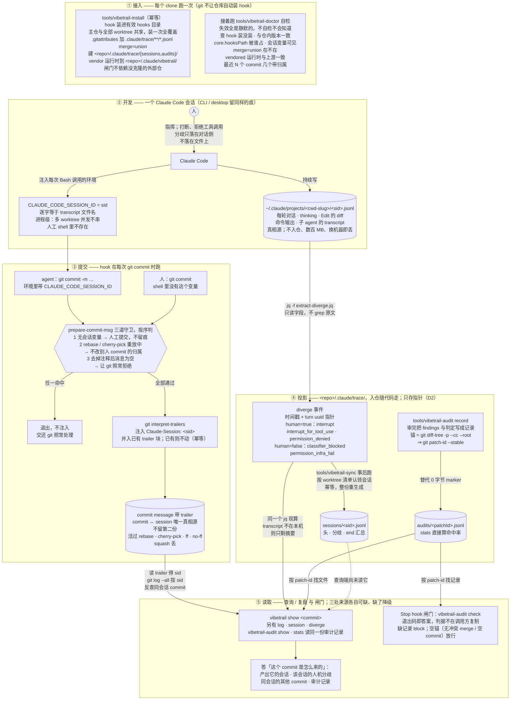

# vibetrail 全流程（详图）

> 概览在 [CAPABILITIES.md §2.0](CAPABILITIES.md)。本文逐步展开：每个节点对应一个脚本、
> 一道判定或一处落盘。实线已实现；唯一一条虚线是还没接上的一段（查询端尚未读 sessions 文件）。
> 圆柱是数据落点，三处里只有 transcript 不入仓。

五段：**接入**每个 clone 一次；**开发**时 Claude Code 自己写流水，并把会话 id 注入
每次 Bash 调用的环境；**提交**时 hook 把这个 id 写进 commit message；**投影**把流水里跨会话
仍有价值的部分固化进仓；**读取**按 sid 与 patch-id 把三处数据接回去——查询端答「这个 commit
是怎么来的」，闸门端答「这个 commit 审过没有」。

commit ↔ 会话之间只靠**一个 id** 接：Claude Code 注入进程环境的 `CLAUDE_CODE_SESSION_ID`，
被 hook 写进 trailer，又逐字等于 transcript 文件名。审计记录另按 patch-id 锚到 commit 的改动上
（[spec §4](spec/trace-v1.md)）。两把钥匙都在 commit 本身上——sid 读 trailer，patch-id 算 diff——
trace 里不存第二份关联，这就是 [spec §2](spec/trace-v1.md)「不留第二份」的由来。
